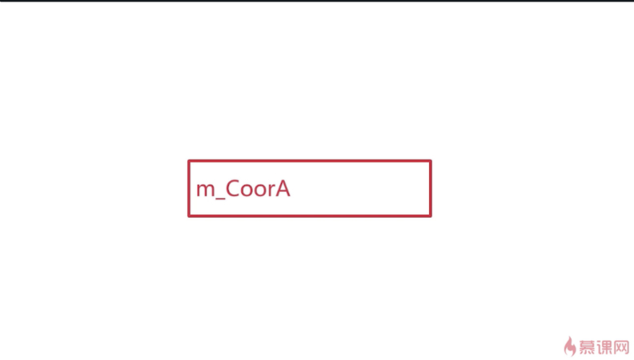
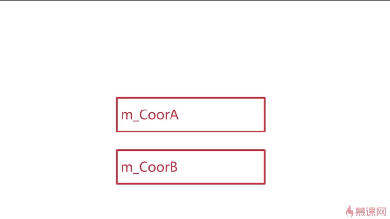
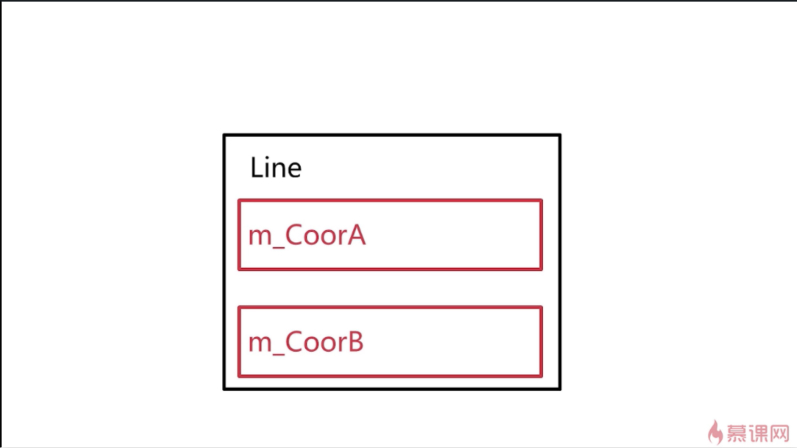

## 说明
以坐标系中的线段AB为例，以此来说明对象成员。如果要定义这样坐标的类，需要定义一个表示点的类和一个表示坐标上的线段的类。


  
定义表示点的类
``` cpp
class Coordinate
{
public:
	Coordinate();  //构造函数
private:
	int m_iX;  //横坐标
	int m_iY;  //纵坐标
};
```  

定义表示线段的类
```cpp
class Line
{
public:
	Line();
private:
	Coordinate m_CoorA;  //线段的起点
	Coordinate m_CoorB;  /*线段的终点   且这两个点的类型必须是  
										上面定义的坐标类型的。*/
};
```  
实例化一条线段
```cpp
int main(void)
{
	Line *p = new Line();
	
	delete p;
	p = NULL;
	return 0;
}
```  
当我们实例化一个Line的对象时，会先实例化m_CoorA这个坐标点,然后再实例化m_CoorB这个坐标点。当这两个对象实例化完成之后，最后在实例化Line对象。





