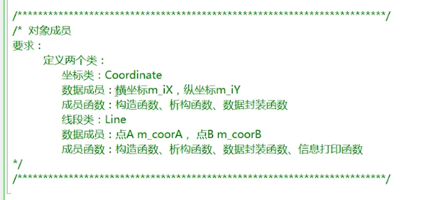
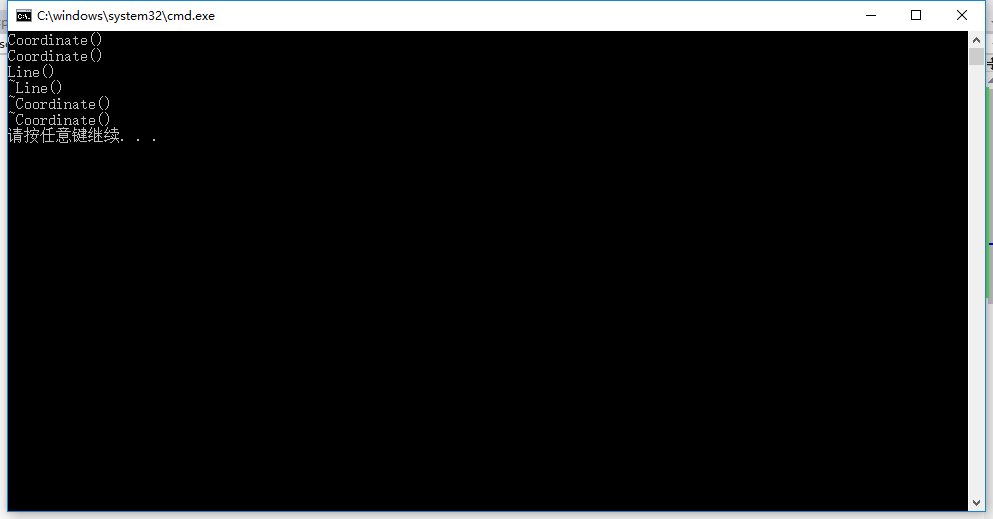
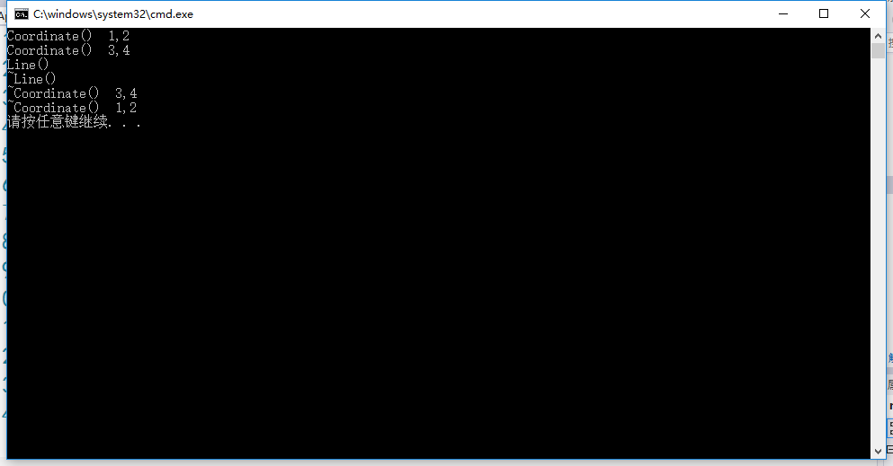
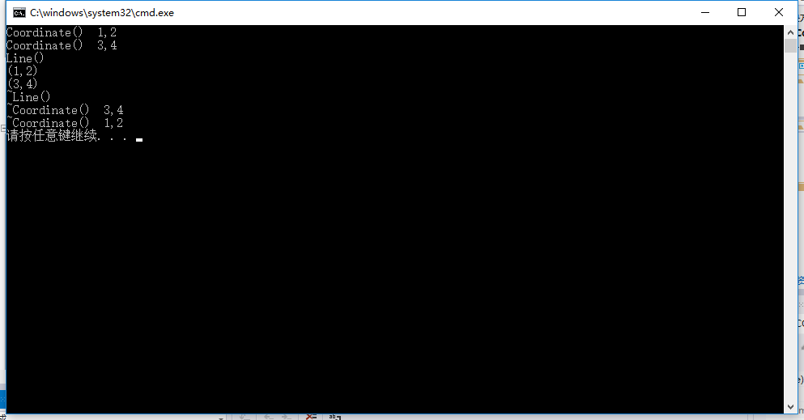

## 例子
要求如图：

<br/>

Coordinate.h
```h
class Coordinate
{
public:
	Coordinate();
	~Coordinate();
	void setX(int x);
	int getX();
	void setY(int y);
	int getY();
private:
	int m_iX;
	int m_iY;
};
```

Line.h
```h
#include "Coordinate.h"

class Line
{
public:
	Line();
	~Line();
	void setA(int x, int y);
	void setB(int x, int y);
	void printInfo();
private:
	Coordinate m_coorA;
	Coordinate m_coorB;
};
```

Coordinate.cpp
```cpp
#include <iostream>
#include "Coordinate.h"
using namespace std;

Coordinate::Coordinate()
{
	cout << "Coordinate()" << endl;
}

Coordinate::~Coordinate()
{
	cout << "~Coordinate()" << endl;
}

void Coordinate::setX(int x)
{
	m_iX = x;
}

int Coordinate::getX()
{
	return m_iX;
}

void Coordinate::setY(int y)
{
	m_iY = y;
}

int Coordinate::getY()
{
	return m_iY;
}
```

Line.cpp
```cpp
#include <iostream>
#include "Line.h"
using namespace std;

Line::Line()
{
	cout << "Line()" << endl;
}

Line::~Line()
{
	cout << "~Line()" << endl;
}

void Line::setA(int x, int y)
{
	m_coorA.setX(x);
	m_coorA.setY(y);
}

void Line::setB(int x, int y)
{
	m_coorB.setX(x);
	m_coorB.setY(y);
}

void Line::printInfo()
{
	cout << "(" << m_coorA.getX() << "," << m_coorA.getY() << ")" << endl;
	cout << "(" << m_coorB.getX() << "," << m_coorB.getY() << ")" << endl;
}
```

demo.cpp
```cpp
#include <iostream>
#include <stdlib.h>
#include "Line.h"
using namespace std;

int main(void)
{
	Line *p = new Line();/*因为Line有一个默认构造函数，所以这里也  
	                       可以写成Line *p = new Line;*/
	delete p;
	p = NULL;

	system("pause");
	return 0;
}
```
<br/>

此时，运行结果为：

意味着，先创建了两个坐标类的对象，即A点和B点，然后才调用线段这个对象，即线段这个对象是在A点和B点创建完成之后才创建的。销毁时，先调用的是线段的析构函数，然后才调用两个坐标点的析构函数。

### 附加
作为一个线段来说，我们希望的是在这个线段创建的时候就已经将里面的两个点一起确定下来。为了达到这个目的，我们往往需要线段这个类的构造函数带有参数，并且这个参数将来能够传递给这两个点。

Coordinate.h
```h
class Coordinate
{
public:
	Coordinate(int x, int y);
	~Coordinate();
	void setX(int x);
	int getX();
	void setY(int y);
	int getY();
private:
	int m_iX;
	int m_iY;
};
```

Line.h
```h
#include "Coordinate.h"

class Line
{
public:
	Line(int x1, int y1, int x2, int y2);//分别代表A点和B点的坐标.
	~Line();
	void setA(int x, int y);
	void setB(int x, int y);
	void printInfo();
private:
	Coordinate m_coorA;
	Coordinate m_coorB;
};
```

Coordinate.cpp
```cpp
#include <iostream>
#include "Coordinate.h"
using namespace std;

Coordinate::Coordinate(int x, int y)
{
	m_iX = x;
	m_iY = y;
	cout << "Coordinate()  " << m_iX << "," << m_iY << endl;
}

Coordinate::~Coordinate()
{
	cout << "~Coordinate()  " << m_iX << "," << m_iY << endl;
}

void Coordinate::setX(int x)
{
	m_iX = x;
}

int Coordinate::getX()
{
	return m_iX;
}

void Coordinate::setY(int y)
{
	m_iY = y;
}

int Coordinate::getY()
{
	return m_iY;
}
```

Line.cpp
```cpp
#include <iostream>
#include "Line.h"
using namespace std;

Line::Line(int x1, int y1, int x2, int y2):m_coorA(x1, y1),m_coorB(x2, y2)
{
	cout << "Line()" << endl;
}

Line::~Line()
{
	cout << "~Line()" << endl;
}

void Line::setA(int x, int y)
{
	m_coorA.setX(x);
	m_coorA.setY(y);
}

void Line::setB(int x, int y)
{
	m_coorB.setX(x);
	m_coorB.setY(y);
}

void Line::printInfo()
{
	cout << "(" << m_coorA.getX() << "," << m_coorA.getY() << ")" << endl;
	cout << "(" << m_coorB.getX() << "," << m_coorB.getY() << ")" << endl;
}
```

demo.cpp
```cpp
#include <iostream>
#include <stdlib.h>
#include "Line.h"
using namespace std;

int main(void)
{
	Line *p = new Line(1,2,3,4);
	delete p;
	p = NULL;

	system("pause");
	return 0;
}
```
<br/>

此时，运行结果为：

意味着，先实例化A点，再实例化B点，最后实例化线段。销毁的时候，先销毁线段，再销毁B点，最后销毁A点。

<br/>

然后将demo.cpp改成：
```cpp
#include <iostream>
#include <stdlib.h>
#include "Line.h"
using namespace std;

int main(void)
{
	Line *p = new Line(1,2,3,4);
	p->printInfo();
	delete p;
	p = NULL;

	system("pause");
	return 0;
}
```
此时，运行结果为：

前3行是构造函数所打印出来的信息，第4、5行是printInfo()打印的，最后3行则是析构函数打印的信息。
### 小总结
如果坐标这个类有一个默认的构造函数（即不带参数的构造函数），那么它就可以在实例化线段对象的时候，不使用初始化列表。如果坐标类要求必须要有参数传入，那么在实例化线段类的时候，就必须要使用初始化列表的方式将相应的值传递给坐标类。