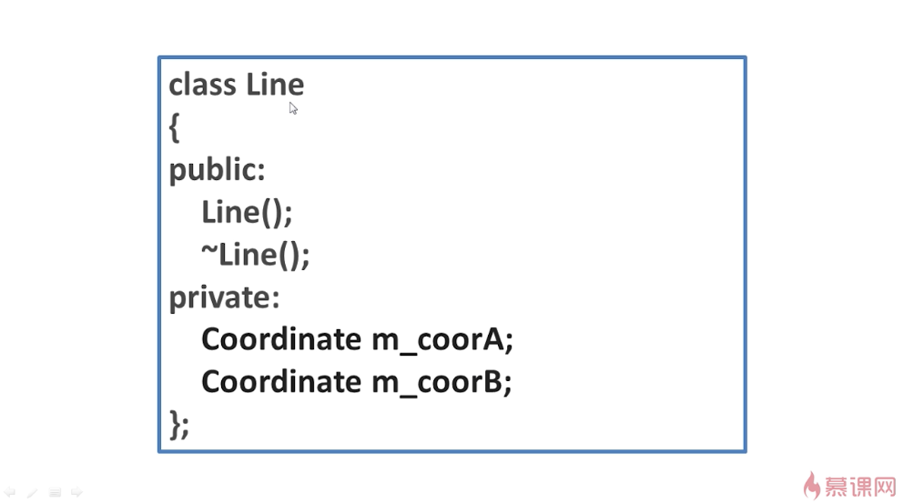
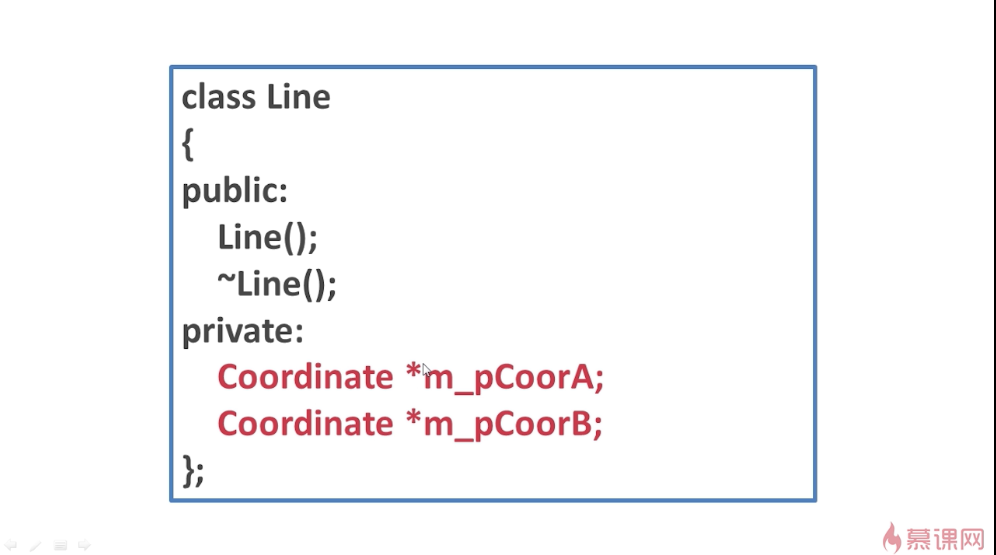
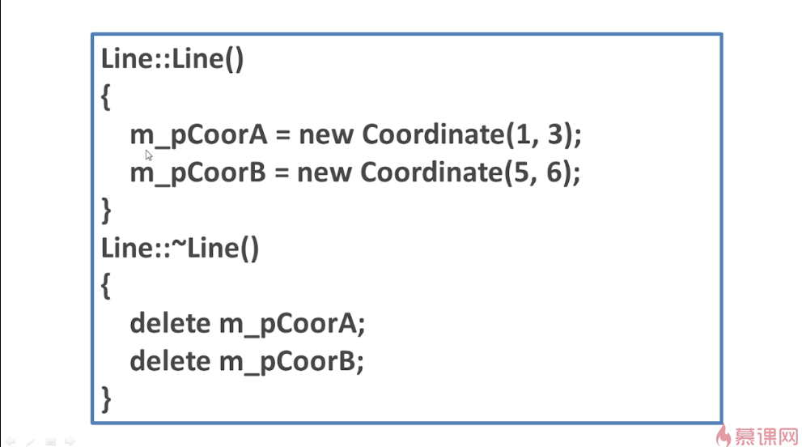
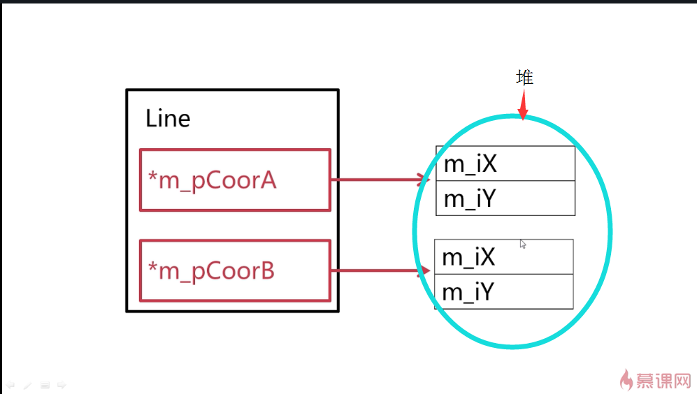

## 对象成员指针
对象的指针作为另外一个对象的数据成员。

例子：

一个坐标类

还定义了一个线段（这里用line1来指代）

一个起点m_coorA，一个终点m_coorB。
现在想把它变成指针，代码更改如下（对象成员指针的定义，这里用line2来指代）：

初始化的时候，与对象成员的初始化方法可以是一样的，使用初始化列表来初始化。因为它是一个指针，所以可以赋值NULL。除了可以使用初始化列表初始化，也可以使用普通的初始化。上图是两种初始化方法。

更多的是这种情况。因为是两个指针，指针一定要指向某一个对象才能够进行操作，才有意义。这里指向了两个坐标对象。这样就相当于在构造函数中，从堆中分配了内存。因此，析构函数中就要把这个内存释放掉。这样才能保证内存不被泄漏。此外，作为对象成员和对象成员指针还有另外一个很大的不同。

作为对象成员来说，如果我们使用sizeof  line这个对象的话（即sizeof(line)），那么它就应该是里面所有对象的体积的总和。
而对象成员指针则不同。一个指针在32位的编译器下面，它只占4个基本内存单元。这里两个指针占8个基本内存单元。而前面的Coordinate类，它有两个数据成员，都是int类型，所以每一个数据成员都占4个基本的内存单元。
如果sizeof(line)中的line的定义是line1的话，那么它有两个Coordinate,每个Coordinate里有两个int,就占了16个基本的内存单元。而如果line的定义是line2的话，那么就是两个指针，就占了8个基本的内存单元。

## 内存当中的对象成员指针

当实例化line这个对象的时候，两个指针就会被定义出来，这两个指针都占4个基本的内存单元。如果我们在构造函数当中，通过new从堆中申请内存，实例化两个Coordinate对象的话，那这两个Coordinate的对象都是在堆中的，而不在line这个对象的内存当中，所以刚刚使用sizeof(line)的时候得到的是8。
当销毁line这个对象的时候，先释放掉堆中的内存，然后再释放掉line这个对象。