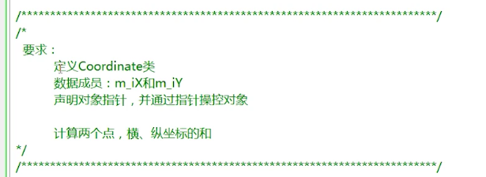
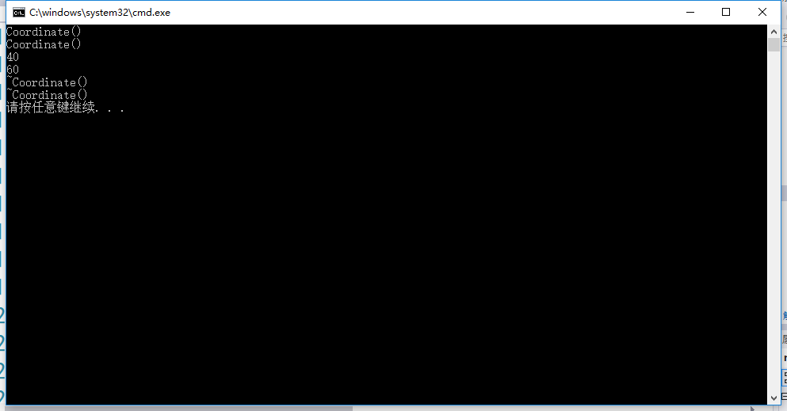

## 对象指针例子
用此例子来说明对象指针的定义和使用方法。
要求如下：



Coordinate.h
```h
class Coordinate
{
public://同样的访问限定符可以出现多次
	Coordinate();//构造函数
	~Coordinate();//析构函数
public:
	int m_iX;
	int m_iY;
};
```

Coordinate.cpp
```cpp
#include "Coordinate.h"
#include <iostream>
using namespace std;

Coordinate::Coordinate()
{
	cout << "Coordinate()" << endl;
}

Coordinate::~Coordinate()
{
	cout << "~Coordinate()" << endl;
}
```

demo.cpp
```cpp
#include <iostream>
#include <stdlib.h>
#include "Coordinate.h"
using namespace std;

//两个对象代表两个坐标点
int main()
{
	Coordinate *p1 = NULL;
	p1 = new Coordinate;//因为定义Coordinate构造函数时是一个默认的
	                    //构造函数，所以也可以
						//写成p1 = new Coordinate();
	Coordinate *p2 = new Coordinate;//两种定义对象的方式由p1、p2
	                                //分别展示。同样的，这里也可以
									//new Coordinate();
	p1->m_iX = 10;//比较正统的访问方式
	p1->m_iY = 20;
	(*p2).m_iX = 30;
	(*p2).m_iY = 40;
	cout << p1->m_iX + (*p2).m_iX << endl;//计算两个坐标的x轴的
	                                      //和，这里p1、p2使用了
										  //两种不同的访问方法。
	cout << p1->m_iY + (*p2).m_iY << endl;
	delete p1;
	p1 = NULL;
	delete p2;
	p2 = NULL;

	system("pause");
	return 0;
}
```
运行结果如下：



## --------------------------------------------------
此外，对象指针还可以指向栈中的一块地址。
快捷键：按住ctrl+k+c就会将选中的代码注视掉。

将demo.cpp的代码更改如下：
```cpp
#include <iostream>
#include <stdlib.h>
#include "Coordinate.h"
using namespace std;

int main()
{
	
	Coordinate p1;//从栈中实例化一个对象
	Coordinate *p2 = &p1;//p2是一个指针，这样就可以通过p2来操作
	                     //p1的数据成员和成员函数了。

	p2->m_iX = 10;//也可以通过(*p2).m_iX来访问
	p2->m_iY = 20;

	cout << p1.m_iX << endl;
	cout << p1.m_iY << endl;

	system("pause");
	return 0;
}
```
运行结果如下：

