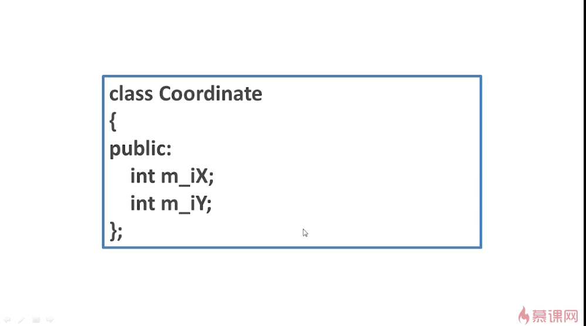

## 对象指针
就是一个指针，它指向一个对象。

图1-例子:

图2：

上图是指针p与Coordinate这个对象在内存中的相关位置以及它们的对应关系。
当我们实例化完以后，就在堆中分配出了一块这样的空间。此时，m_iX的地址与p保存的地址是一致的（即p指向这个对象中的第一个元素m_iX）。通过p->m_iX来访问m_iX这个元素。第二个元素m_iY可以通过p->m_iY来访问，也可以通过(*p).m_iY来访问。*p就使得指针p变成个对象，这样就可以通过“.”来访问数据成员。

## --------------------------------------------------
使用的具体案例：

使用new去实例化，它就会分配内存并调用构造函数。
与C语言相比，new与C语言当中的malloc有着本质的区别。如果使用new，就会自动调用相关对象的构造函数（这里是Coordinate对象）。而使用malloc，则是单纯的分配内存，不会去调用相关对象的构造函数。
例子中，m_ix和m_iY就可以通过图中的两种方式访问。
使用完成后，要使用delete删除掉在堆中的对象，也就释放掉了相关的内存，保证内存不会泄漏。