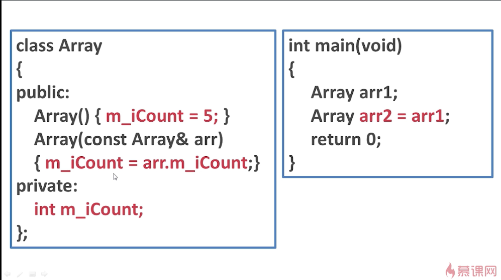
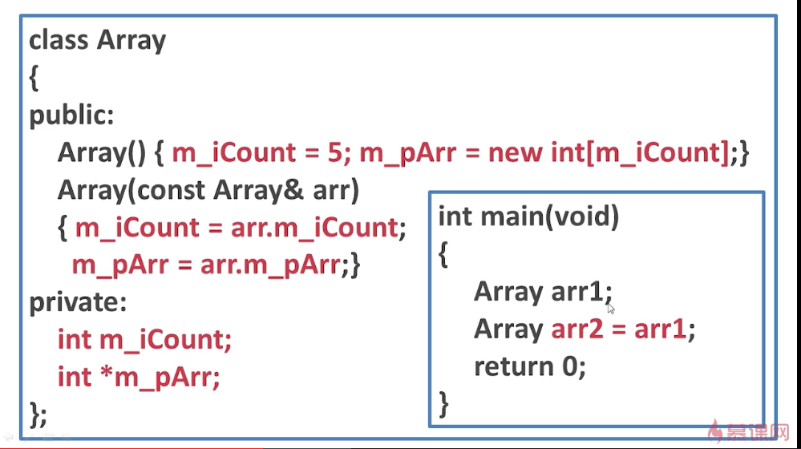
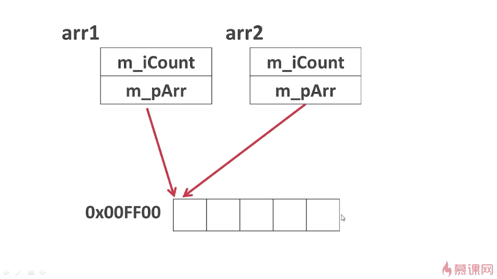
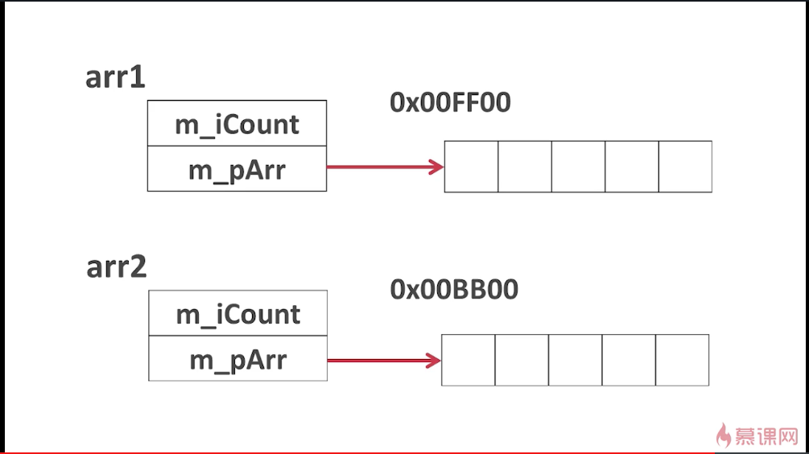
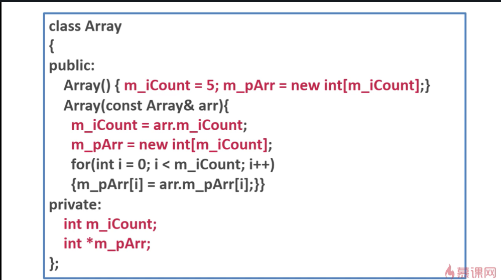

## --------------------------------------------------
对象间的拷贝分为：深拷贝和浅拷贝。

当我们使用时，即图中int main(void)中的代码块，
```
Array arr1;
```
这里会调用到arr1的构造函数，即
Array()
{
	m_iCount = 5;
}
而使用
```
Array arr2 = arr1;
```
即使用arr1去初始化arr2，arr2实例化时就会调用它的拷贝构造函数，即
```
Array(const Array &arr)
{
	m_iCount = arr.m_iCount;
}
```
即arr1.m_iCount赋值给arr2的m_iCount。

<br/>


这里的m_pArr指针的构造函数是从堆中申请一段内存，并且指向了堆中的这段内存，内存大小就是m_iCount。使用时，```Array arr1;```就会调用构造函数，```Array arr2 = arr1;```就会调用arr2的拷贝构造函数。这两个图片中的例子只是将数据成员的值进行了简单的拷贝，这种方式称之为==浅拷贝==。

## --------------------------------------------------
对于例子1来说，使用浅拷贝的方式来实现拷贝构造函数没有问题。但对于例子2来说，是有问题的。
经过浅拷贝之后，对象arr1中的指针和对象arr2中的指针势必会指向同一块内存。因为我们将arr1的m_pArr赋值给了arr2的m_pArr。



此时，如果我们先给arr1的m_pArr赋值，然后再给arr2的m_pArr赋值，那么图中的这段内存就会被重写，而不再是之前arr1的m_pArr的值。最严重的情况是，当我们去销毁arr1这个对象的时候，为了避免内存泄漏，肯定会释放掉arr1的m_pArr所指向的这段内存。如果我们已经释放掉了这段内存，再去销毁arr2对象的时候，以同样方式去释放m_pArr这个指针所指向的那段内存。那么，同样的内存被释放了两次，这样计算机就会崩溃。这种崩溃与语法错误是不同的。
所以，我们希望拷贝构造函数所完成的工作应该是这样的：



两个对象的指针所指向的应该是两个不同的内存，拷贝的时候不是将指针的地址简单的拷贝过来，而是将指针所指向内存当中的每一个元素依次地拷贝过来。如果想要实现这样的效果，例子2的代码应该写成下面的样子：



即当进行对象拷贝时，不是简单的做值的拷贝，而是将堆中内存的数据也进行拷贝，这种拷贝模式称之为==深拷贝==。