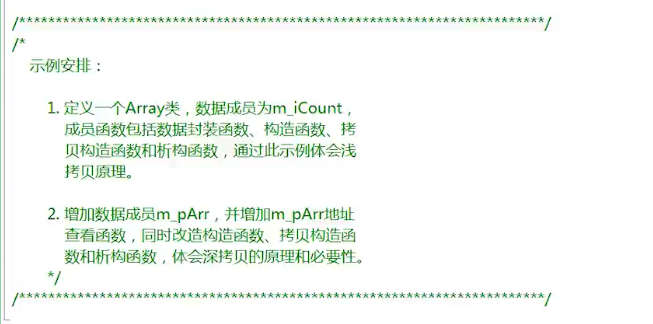
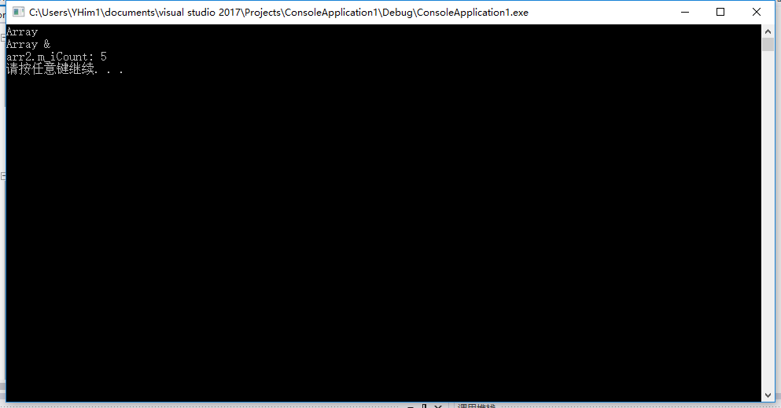

## 例子-浅拷贝
要求如图：

<br/>

Array.h
```h
class Array
{
public:
	Array();
	Array(const Array &arr);
	~Array();
	void setCount(int count);
	int getCount();
private:
	int m_iCount;
};
```

Array.cpp
```cpp
#include <iostream>
#include "Array.h"
using namespace std;

Array::Array()
{
	cout << "Array" << endl;
}

Array::Array(const Array &arr)
{
	m_iCount = arr.m_iCount;
	cout << "Array &" << endl;
}

Array::~Array()
{
	cout << "~Array" << endl;
}

void Array::setCount(int count)
{
	m_iCount = count;
}

int Array::getCount()
{
	return m_iCount;
}
```

demo.cpp
```cpp
#include <iostream>
#include <stdlib.h>
#include "Array.h"
using namespace std;

int main(void)
{
	Array arr1;
	arr1.setCount(5);
	
	Array arr2(arr1);
	cout << "arr2.m_iCount: " << arr2.getCount() << endl;

	system("pause");
	return 0;
}
```

运行结果为：
