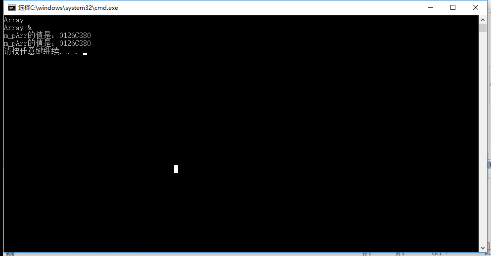
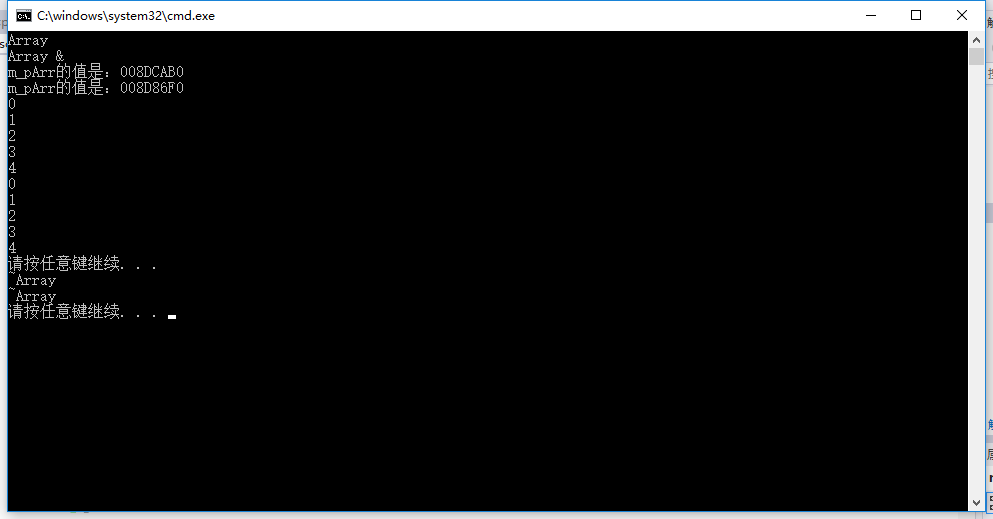

## 例子-深拷贝
要求如图：

<br/>

Array.h
```h
class Array
{
public:
	Array(int count);
	Array(const Array &arr);
	~Array();
	void setCount(int count);
	int getCount();
	void printAddr();
private:
	int m_iCount;
	int *m_pArr;
};
```

Array.cpp
```cpp
#include <iostream>
#include "Array.h"
using namespace std;

Array::Array(int count)
{
	m_iCount = count;
	m_pArr = new int[m_iCount];
	cout << "Array" << endl;
}

Array::Array(const Array &arr)
{
	m_pArr = arr.m_pArr;       //浅拷贝
	m_iCount = arr.m_iCount;
	cout << "Array &" << endl;
}

Array::~Array()
{
	delete []m_pArr;     /*这里释放内存会出错，但运行起来程序没出
	                       错的原因是demo.cpp的main函数中写了
						   system("pause"),当代码运行完后就会出错，
						   即按下任意键后程序会出错。 */
	m_pArr = NULL;
	cout << "~Array" << endl;
}

void Array::setCount(int count)
{
	m_iCount = count;
}

int Array::getCount()
{
	return m_iCount;
}

void Array::printAddr()
{
	cout << "m_pArr的值是：" << m_pArr << endl;
}
```

demo.cpp
```cpp
#include <iostream>
#include <stdlib.h>
#include "Array.h"
using namespace std;

int main(void)
{
	Array arr1(5);
	
	Array arr2(arr1);

	arr1.printAddr();
	arr2.printAddr();

	system("pause");
	return 0;
}
```

运行结果为：


## --------------------------------------------------
解决以上程序的问题就要使用深拷贝。
将代码更改如下：

Array.h
```h
class Array
{
public:
	Array(int count);
	Array(const Array &arr);
	~Array();
	void setCount(int count);
	int getCount();
	void printAddr();
	void printArr();
private:
	int m_iCount;
	int *m_pArr;
};
```

Array.cpp
```cpp
#include <iostream>
#include "Array.h"
using namespace std;

Array::Array(int count)
{
	m_iCount = count;
	m_pArr = new int[m_iCount];
	for (int i = 0; i < m_iCount; i++)
	{
		m_pArr[i] = i;   //为了更清楚的理解，将m_pArr每个元素赋值
	}
	cout << "Array" << endl;
}

Array::Array(const Array &arr)
{
	m_iCount = arr.m_iCount;
	m_pArr = new int[m_iCount];//先申请一段内存
	for (int i = 0; i < m_iCount; i++)/*然后将传入进来的arr的这个
	                                    对象对应位置的内存拷贝到
										申请的那段内存中去*/
	{
		m_pArr[i] = arr.m_pArr[i];
	}
	
	cout << "Array &" << endl;
}

Array::~Array()
{
	delete []m_pArr;
	m_pArr = NULL;
	cout << "~Array" << endl;
}

void Array::setCount(int count)
{
	m_iCount = count;
}

int Array::getCount()
{
	return m_iCount;
}

void Array::printAddr()
{
	cout << "m_pArr的值是：" << m_pArr << endl;
}

void Array::printArr()
{
	for (int i = 0; i < m_iCount; i++)
	{
		cout << m_pArr[i] << endl;
	}
}
```

demo.cpp
```cpp
#include <iostream>
#include <stdlib.h>
#include "Array.h"
using namespace std;

int main(void)
{
	Array arr1(5);
	
	Array arr2(arr1);

	arr1.printAddr();
	arr2.printAddr();
	arr1.printArr();
	arr2.printArr();

	system("pause");
	return 0;
}
```

运行结果为:

可以看到指向的不再是同一块内存了,按了任意键之后程序也没有崩溃掉。
第一遍打印出来的0、1、2、3、4是arr1中的，第二遍是arr2中的。