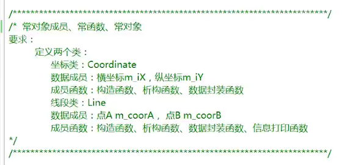
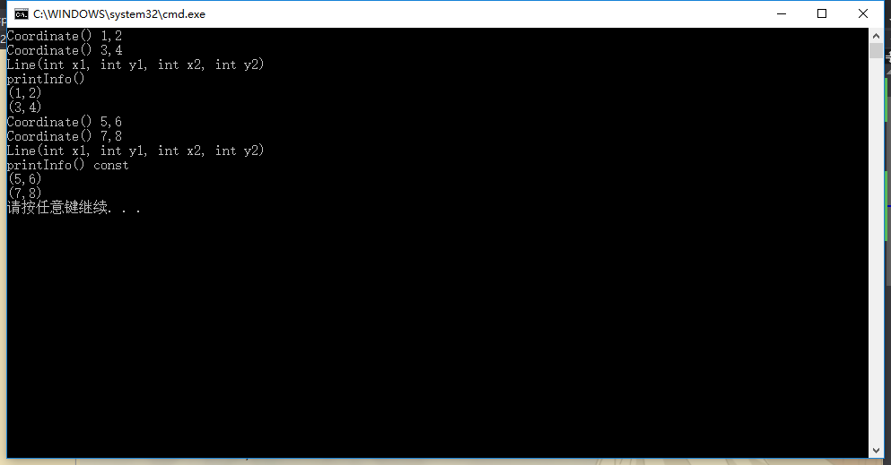

## 常对象成员和常成员函数例子
要求如下：



Coordinate.h
```h
class Coordinate
{
public:
	Coordinate(int x, int y);
	~Coordinate();
	void setX(int x);
	int getX() const;
	void setY(int y);
	int getY() const;
private:
	int m_iX;
	int m_iY;
};
```

Coordinate.cpp
```cpp
#include <iostream>
#include "Coordinate.h"
using namespace std;

Coordinate::Coordinate(int x, int y)
{
	m_iX = x;
	m_iY = y;
	cout << "Coordinate() " << m_iX << "," << m_iY << endl;
}

Coordinate::~Coordinate()
{
	cout << "~Coordinate() " << m_iX << "," << m_iY << endl;
}

void Coordinate::setX(int x)
{
	m_iX = x;
}

int Coordinate::getX() const
{
	return m_iX;
}

void Coordinate::setY(int y)
{
	m_iY = y;
}

int Coordinate::getY() const
{
	return m_iY;
}
```

Line.h
```h
#include "Coordinate.h"

class Line
{
public:
	Line(int x1, int y1, int x2, int y2);
	~Line();
	void setA(int x, int y);
	void setB(int x, int y);
	void printInfo();
	void printInfo() const;
private:
	const Coordinate m_coorA;//const既可以写在类名前面，
	Coordinate const m_coorB;//也可以写在类名后面。
};
```

Line.cpp
```cpp
#include <iostream>
#include "Line.h"
using namespace std;

Line::Line(int x1, int y1, int x2, int y2):m_coorA(x1,y1),m_coorB(x2,y2)
{
	cout << "Line(int x1, int y1, int x2, int y2)" << endl;
}

Line::~Line()
{
	cout << "~Line()" << endl;
}

void Line::setA(int x, int y)
{
	//m_coorA.setX(x);
	//m_coorA.setY(y);
}

void Line::setB(int x, int y)
{
	//m_coorB.setX(x);
	//m_coorB.setY(y);
}

void Line::printInfo()
{
	cout << "printInfo()" << endl;
	cout << "(" << m_coorA.getX() << "," << m_coorA.getY() << ")" << endl;
	cout << "(" << m_coorB.getX() << "," << m_coorB.getY() << ")" << endl;
}

void Line::printInfo() const
{
	cout << "printInfo() const" << endl;
	cout << "(" << m_coorA.getX() << "," << m_coorA.getY() << ")" << endl;
	cout << "(" << m_coorB.getX() << "," << m_coorB.getY() << ")" << endl;
}
```

demo.cpp
```cpp
#include <iostream>
#include <stdlib.h>
#include "Line.h"
using namespace std;

int main()
{
	Line line(1, 2, 3, 4);
	line.printInfo();//调用的是普通成员函数

	const Line line2(5,6,7,8);
	line2.printInfo();//调用的是常成员函数

	system("pause");
	return 0;
}
```

运行结果：



### 总结：
1. 常对象只能调用常成员函数。
2. 普通对象可以调用全部成员函数。
3. 当对一个对象调用成员函数时，编译程序先将对象的地址赋给this指针，然后调用成员函数，每次成员函数存取数据成员时，由隐含使用this指针。
4. 当一个成员函数被调用时，自动向它传递一个隐含的参数，该参数是一个指向这个成员函数所在的对象的指针。 
5. 在C++中，this指针被隐含地声明为: X *const this,这意味着不能给this 指针赋值；
   在X类的const成员函数中，this指针的类型为：const X* const, 这说明this指针所指向的这种对象是不可修改的（即不能对这种对象的数据成员进行赋值操作）; 
6. 由于this并不是一个常规变量，所以，不能取得this的地址。   
由于a是const对象，所以a只能调用类A中的常成员函数。
那么为什么会提示：“不能将this指针.....”的语句呢
因为对于c++的成员函数（当然不是静态成员函数),都会含有一个隐藏的参数，对于上例A中的int GetValue()函数，在编译后会变成：
int GetValue(A * const this);  //不能修改this变量，但可以修改this指向的内容，即：this是常量指针。
而对于int GetValue()const ，编译后是：
int GetValue(const A* const this); 
只所以this指针是const类型，从编译后的结果看就很清楚了， 因为a是const，所以其this指针就对应： const A* const this ;
而print函数被编译出来后对应的是void print(A* const this); 在进行参数匹配时， 所以就会提示 “不能将“this”指针从“const A .."
this指针的出现就解释了，用哪一个对象的数据成员。通常情况下，this指针是隐含存在的，也可以将其显示的表示出来（即如上例中的 this->mValue。不过this指针只能在类中使用）
还有就是  this指针是一个const指针；