## 常对象成员和常成员函数
例子：

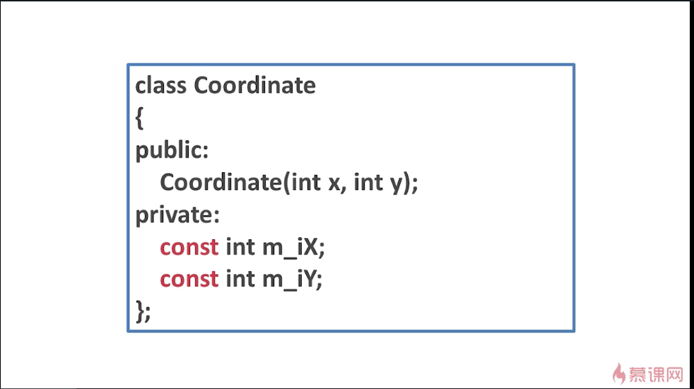

这是一个坐标类，定义的两个数据成员都用const来修饰。

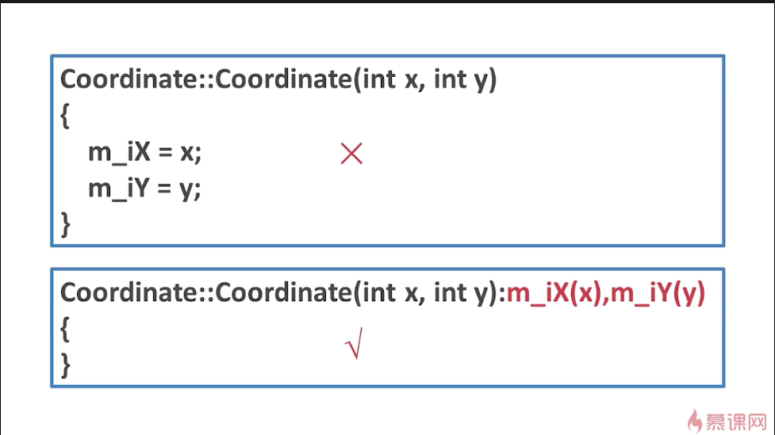

上面的初始化方法是错误的，必须通过下面的这种初始化列表的方式才能成功。
如果对象作为数据成员，const能否修饰呢？当然可以。我们把这种数据成员称为**常对象数据成员**。

为方便理解，以线段为例：

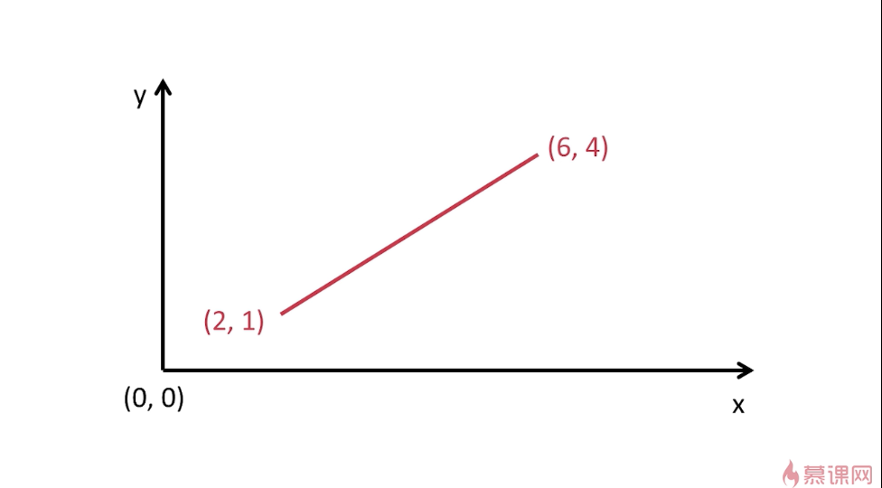

有如图的线段，当线段的位置被确定后，就不允许更改了(即一旦起点(2,1)和终点(6,4)被确定后)。要想达到这个目的，就要将代码写成下面的样子：

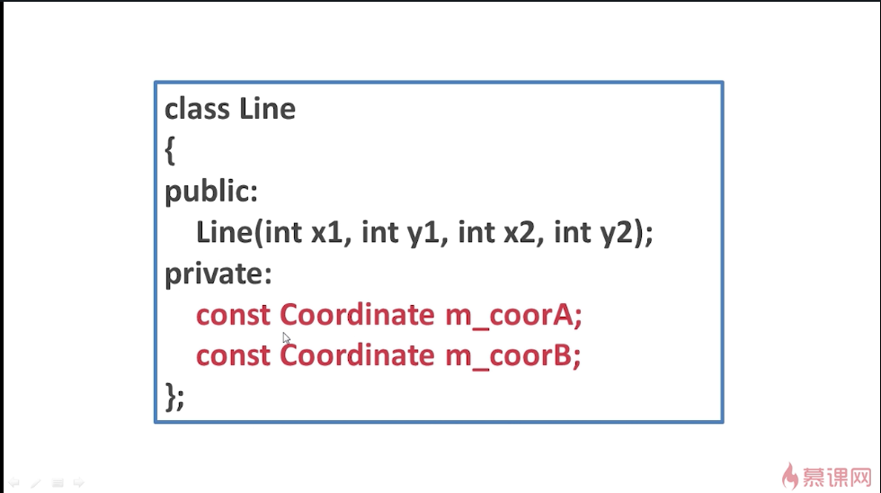

这是一个线段的类，它有两个对象成员，一个A点，一个B点。因为要实现一旦初始化A、B两个点就不能再修改，所以就将两个点定义为const，即**常对象**。想要初始化这两个点就要使用初始化列表的方式：

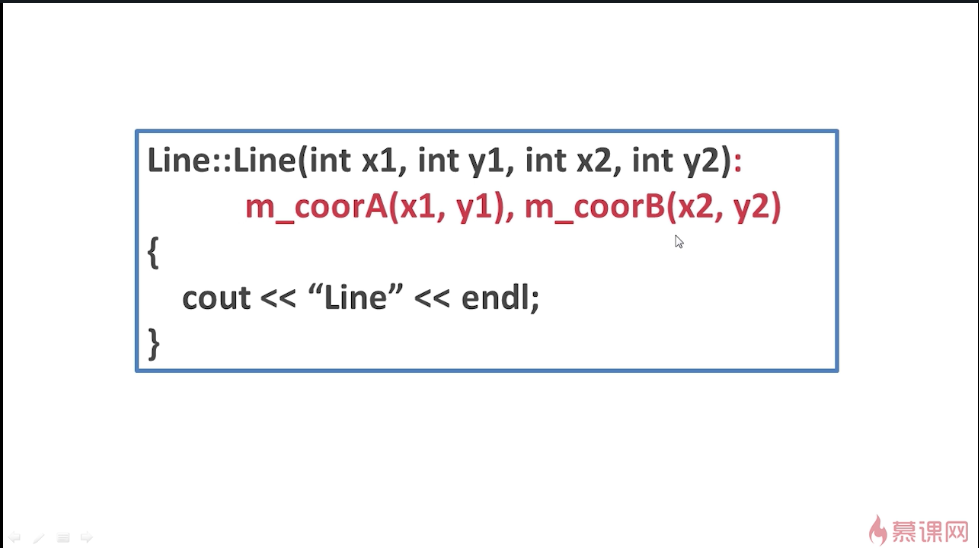

调用：

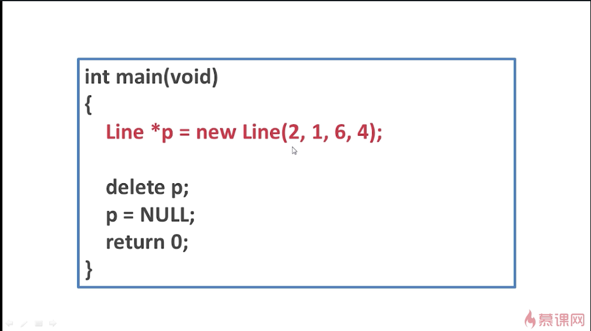

### -----------------------------------------------------------------
用const修饰的成员函数就称为**常成员函数**。
写法：

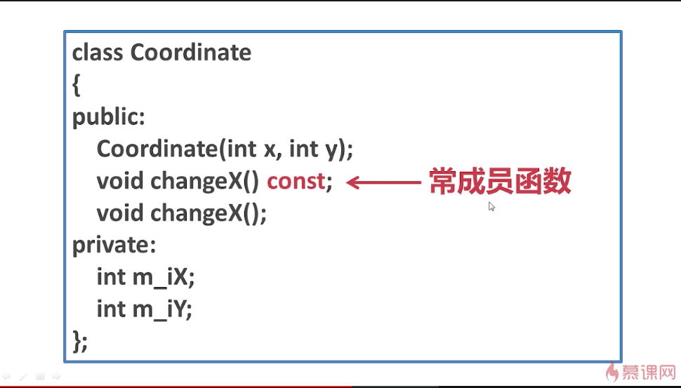

定义成员函数：

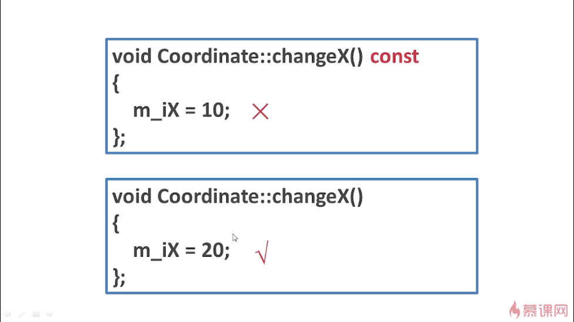

为什么在常成员函数中不能修改数据成员的值呢？
当定义changeX()这个成员函数的时候，看上去这个成员函数貌似没有任何的参数，而实际上却隐含着一个参数(this指针)。

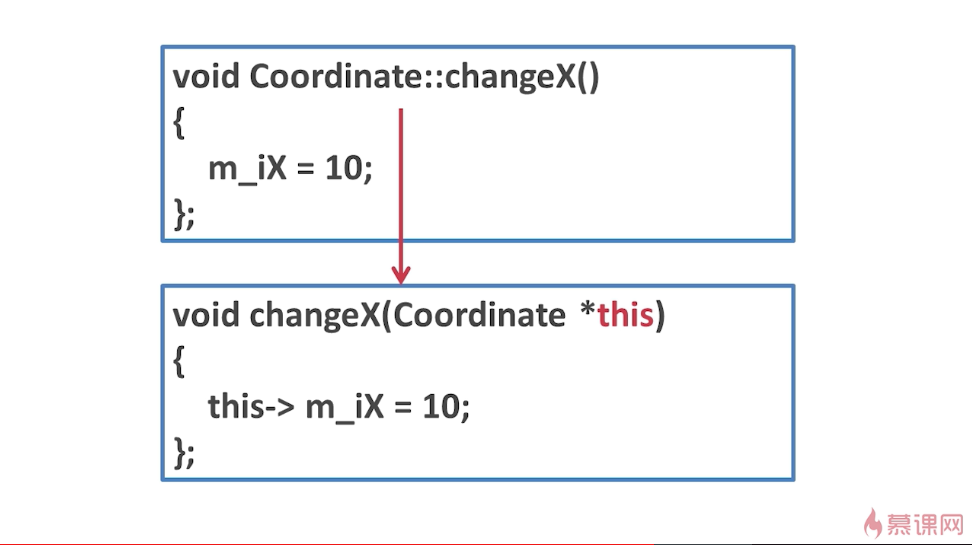

当定义一个常成员函数时，编译器就会理解成这个样子：

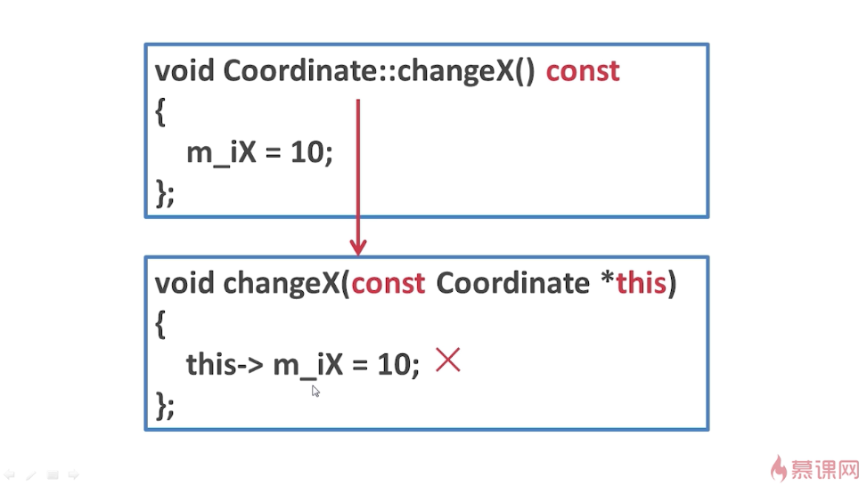

它的参数中隐含着一个this指针，但this指针是用const修饰的。显然，这个this指针已经变成了一个常指针，通过常指针去改变该指针指向的数据，是不被允许的。
所以，在常成员函数中修改数据成员的值就是错误的。
### -----------------------------------------------------------------
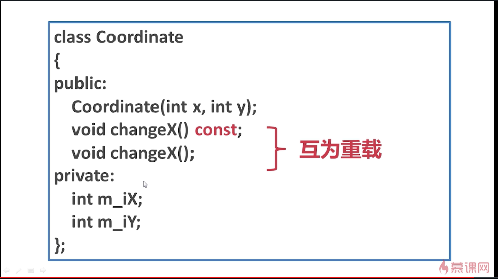

这两个changeX()互为重载。但这种写法不推荐。

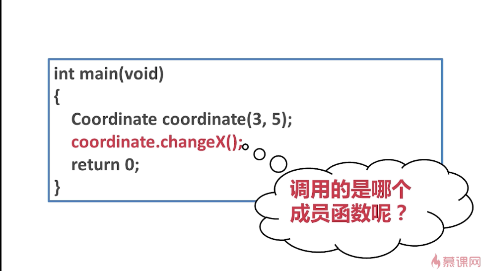

这样就可能会疑惑。这里调用的是不带const的成员函数。
那么，什么情况下可以调用常成员函数呢？
必须要写成这样：

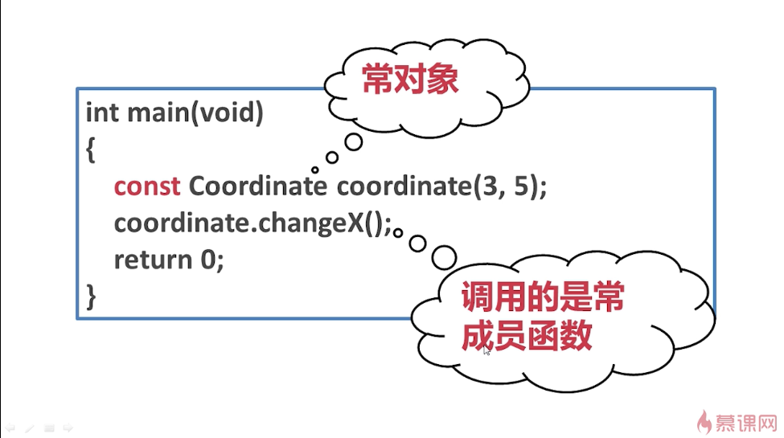

在实例化对象时，要用const来修饰这个对象。也把这样实例化出来的对象称之为**常对象**。