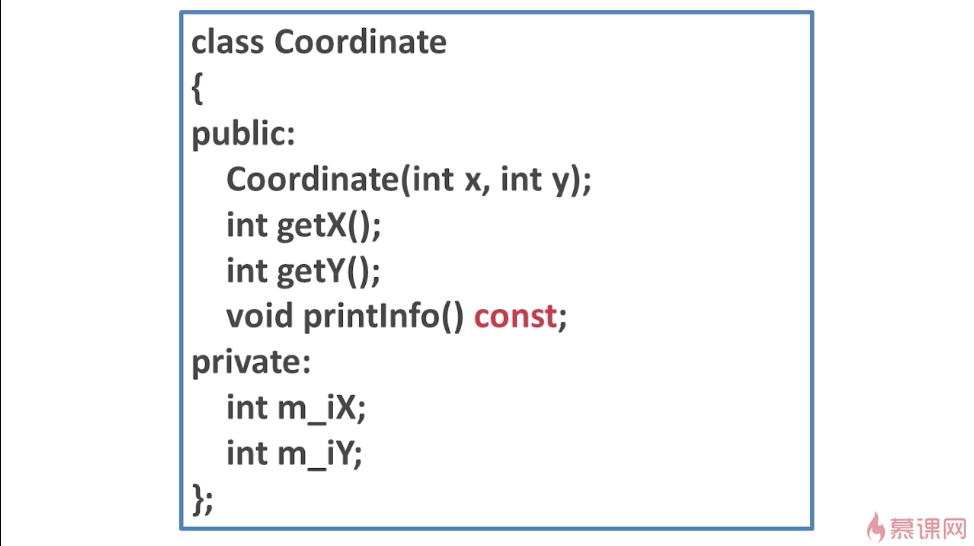
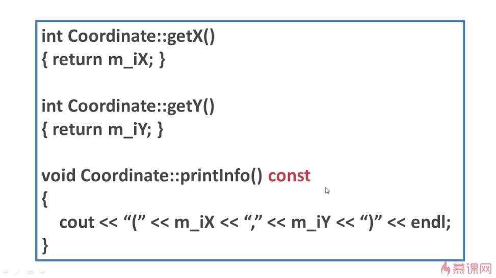
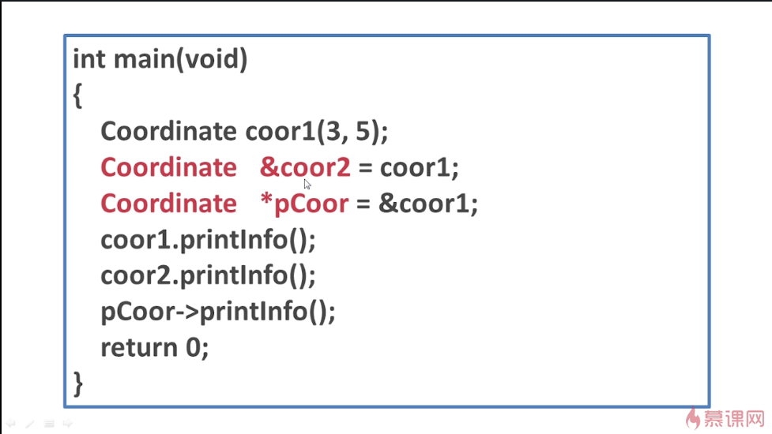
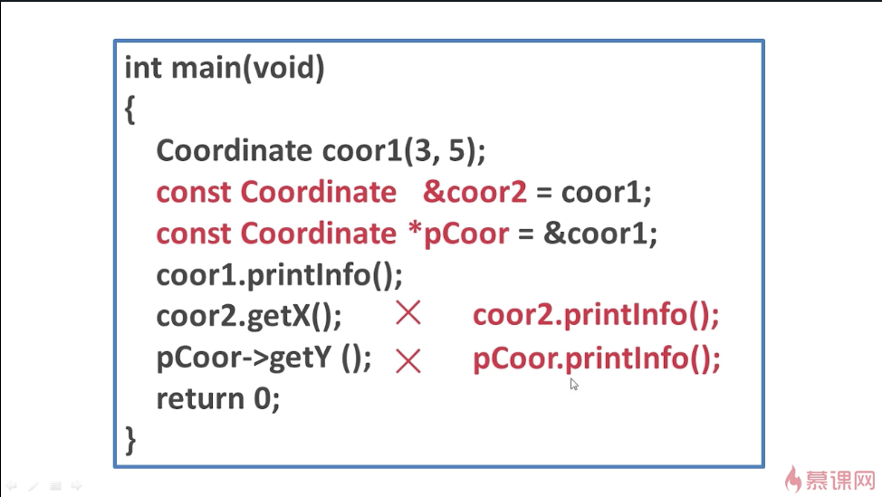
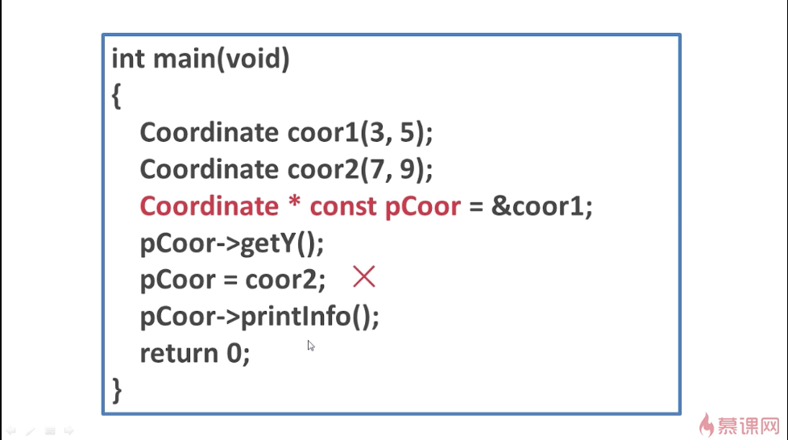

## 常指针与常引用
定义这样一个类：

对象的引用和对象的指针的定义：

当实例化一个对象coor1后，就可以给coor1起一个别名coor2，即定义一个引用coor2，并将coor2指向coor1。coor2.printInfo()就会输出coor1的坐标。

当定义一个对象的指针，并将它指向coor1时，那么使用pCoor->printInfo()也会打印出coor1的坐标。

如果在定义的语句之前加上const，那么就是常引用和常指针。

## -------------------------------------------------------

定义了一个对象的常引用和一个对象的常指针。

这里coor2.getX()错误，因为coor2是常引用，而getX()并不是常成员函数。作为常引用来说，它只有一个读权限，而getX()这里要求的参数this（即默认隐藏的this）是要有读写权限的。所以要想使用coor2来调用它的常成员函数，只能调用printInfo()。

同理，使用pCoor->getY()错误，因为pCoor这个指针是常指针，它只有只读权限，getY()要求的隐藏的this参数也是读写权限。

## -------------------------------------------------------

(注意这里const的位置变了)

此时，定义的pCoor一旦指向了一个对象，那么它就不能再指向另外的对象了，但是指针指向的对象的内容是可变的。

由此可见，pCoor是一个具有读写权限的指针。因此，pCoor->getY()是正确的。第二句应该改成pCoor = &coor2;

第三句pCoor->printInfo()，因为printInfo()是常成员函数，所以隐藏的this指针要求只读权限，而pCoor是读写权限，所以这一句也正确。

### 总结
const *p             ----- *p不可以再赋值

*const p             -----  p不可以再赋值

const * const p   ----- *p和p都不可以再赋值

不能把小权限的指向大权限的，但是可以把大权限的指向小权限的。