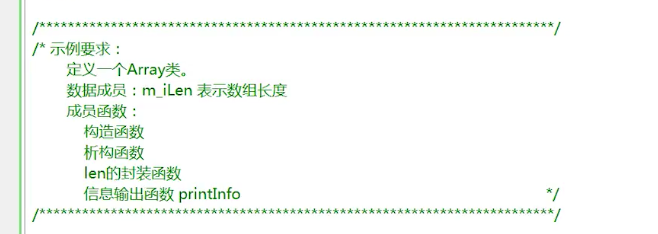

## this指针例子
要求如下：



简单的this指针用法：
Array.h
```h
class Array
{
public:
	Array(int len);
	~Array();
	void setLen(int len);
	int getLen();
	void printInfo();
private:
	int len;
};
```

Array.cpp
```cpp
#include <iostream>
#include "Array.h"
using namespace std;

Array::Array(int len)
{
	this->len = len;
}

Array::~Array()
{
	
}

void Array::setLen(int len)
{
	this->len = len;
}

int Array::getLen()
{
	return len;
}

void Array::printInfo()
{
	
}
```

demo.cpp
```cpp
#include "Array.h"
#include <iostream>
#include <stdlib.h>
using namespace std;

int main()
{
	Array arr1(10);
	cout << arr1.getLen() << endl;

	system("pause");
	return 0;
}
```

## --------------------------------------------------
this指针比较特殊的用法：
Array.h
```h
class Array
{
public:
	Array(int len);
	~Array();
	void setLen(int len);
	int getLen();
	Array printInfo(); //将返回值改为Array
private:
	int len;
};
```

Array.cpp
```cpp
#include <iostream>
#include "Array.h"
using namespace std;

Array::Array(int len)
{
	this->len = len;
}

Array::~Array()
{
	
}

void Array::setLen(int len)
{
	this->len = len;
}

int Array::getLen()
{
	return len;
}

Array Array::printInfo()   //与之前代码相比，把返回值改为了Array
{
	cout << "len = " << len << endl;
	return *this;  //this本身是一个指针，*this就是一个对象，而这里要求的返回值就是返回一个Array对象。
}
```

demo.cpp
```cpp
#include "Array.h"
#include <iostream>
#include <stdlib.h>
using namespace std;

int main()
{
	Array arr1(10);
	arr1.printInfo();

	system("pause");
	return 0;
}
```

运行结果为：


this指针的返回价值：代码中this指针返回回来之后就意味着调用printInfo()这个函数之后，可以在后面用“.”来访问更多的内容。比如说上面代码中的arr1.printInfo().setLen(5);
那么，这里的setLen(5)是不是改变的是arr1中的值呢？
将demo.cpp中的代码改成下面的：
```cpp
#include "Array.h"
#include <iostream>
#include <stdlib.h>
using namespace std;

int main()
{
	Array arr1(10);
	arr1.printInfo().setLen(5);
	cout << "len = " << arr1.getLen() << endl;

	system("pause");
	return 0;
}
```

运行结果为：


可见，在这里使用setLen并没有改变arr1的值。
这是因为：返回的*this返回出来变成了另一个Array对象，这个对象是一个临时的对象，它并不是arr1。如果想要它返回的是arr1，就要将Array.cpp中的
```cpp
Array Array::printInfo()
```

更改为：(加上一个引用符号)
```cpp
Array& Array::printInfo()
```

Array.h里面相应的地方也要进行更改。即再将Array.cpp和Array.h代码更改成下面的：
Array.h
```h
class Array
{
public:
	Array(int len);
	~Array();
	void setLen(int len);
	int getLen();
	Array& printInfo(); 
private:
	int len;
};
```

Array.cpp
```cpp
#include <iostream>
#include "Array.h"
using namespace std;

Array::Array(int len)
{
	this->len = len;
}

Array::~Array()
{
	
}

void Array::setLen(int len)
{
	this->len = len;
}

int Array::getLen()
{
	return len;
}

Array& Array::printInfo()   
{
	cout << "len = " << len << endl;
	return *this;
}
```

运行结果为：


可以看到，更改了arr1的值。

### --------------------------------------------------
比如要想在setLen()后面继续用"."来访问更多的内容，要将代码更改如下：
Array.h
```h
class Array
{
public:
	Array(int len);
	~Array();
	Array& setLen(int len);//做出更改
	int getLen();
	Array& printInfo(); 
private:
	int len;
};
```

Array.cpp
```cpp
#include <iostream>
#include "Array.h"
using namespace std;

Array::Array(int len)
{
	this->len = len;
}

Array::~Array()
{
	
}

Array& Array::setLen(int len)//做出更改
{
	this->len = len;
	return *this;//做出更改
}

int Array::getLen()
{
	return len;
}

Array& Array::printInfo()   
{
	cout << "len = " << len << endl;
	return *this;
}
```

demo.cpp
```cpp
#include "Array.h"
#include <iostream>
#include <stdlib.h>
using namespace std;

int main()
{
	Array arr1(10);
	arr1.printInfo().setLen(5).printInfo();//做出更改

	system("pause");
	return 0;
}
```

运行结果为：


arr1.printInfo().setLen(5).printInfo()这里首先用printInfo()打印出arr1中的值，然后通过setLen(5)将arr1中的值设置为5，最后再用printInfo()打印出arr1中的值。因为每次都使用的是Array的引用（即Array&），所以实际就是在操作arr1这个对象。
### --------------------------------------------------
如果return的不是引用，而是指针，那又应该如何去写呢？
Array.h
```h
class Array
{
public:
	Array(int len);
	~Array();
	Array* setLen(int len);//做出更改
	int getLen();
	Array* printInfo(); //做出更改
private:
	int len;
};
```

Array.cpp
```cpp
#include <iostream>
#include "Array.h"
using namespace std;

Array::Array(int len)
{
	this->len = len;
}

Array::~Array()
{
	
}

Array* Array::setLen(int len)//做出更改
{
	this->len = len;
	return this;//做出更改(因为要求的就是返回指针，this是指针，*this是对象)
}

int Array::getLen()
{
	return len;
}

Array* Array::printInfo()   //做出更改
{
	cout << "len = " << len << endl;
	return this;//做出更改
}
```

demo.cpp
```cpp
#include "Array.h"
#include <iostream>
#include <stdlib.h>
using namespace std;

int main()
{
	Array arr1(10);
	arr1.printInfo()->setLen(5)->printInfo();//做出更改(因为是指针，所以用“->”来访问)

	system("pause");
	return 0;
}
```

运行结果为：


这也证明了，无论是通过指针还是引用，都可以改变实际的值。
### --------------------------------------------------
通过代码来说明this的本身的值(它就相当于它所在的对象的地址)
Array.h
```h
class Array
{
public:
	Array(int len);
	~Array();
	Array* setLen(int len);
	int getLen();
	Array* printInfo(); 
private:
	int len;
};
```

Array.cpp
```cpp
#include <iostream>
#include "Array.h"
using namespace std;

Array::Array(int len)
{
	this->len = len;
}

Array::~Array()
{
	
}

Array* Array::setLen(int len)
{
	this->len = len;
	return this;
}

int Array::getLen()
{
	return len;
}

Array* Array::printInfo()   
{
	cout << this << endl;//做出更改(打印this的地址)
	return this;
}
```

demo.cpp
```cpp
#include "Array.h"
#include <iostream>
#include <stdlib.h>
using namespace std;

int main()
{
	Array arr1(10);
	arr1.printInfo();//做出更改，打印this的值
	cout << &arr1 << endl;//打印arr1的地址

	system("pause");
	return 0;
}
```

运行结果为：

