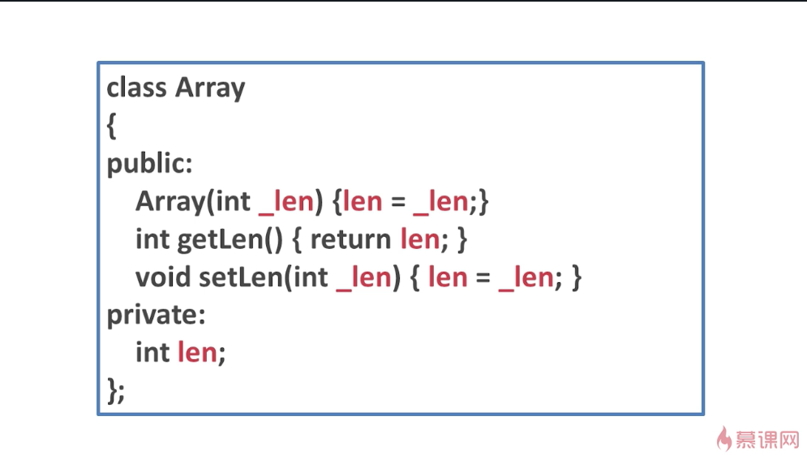
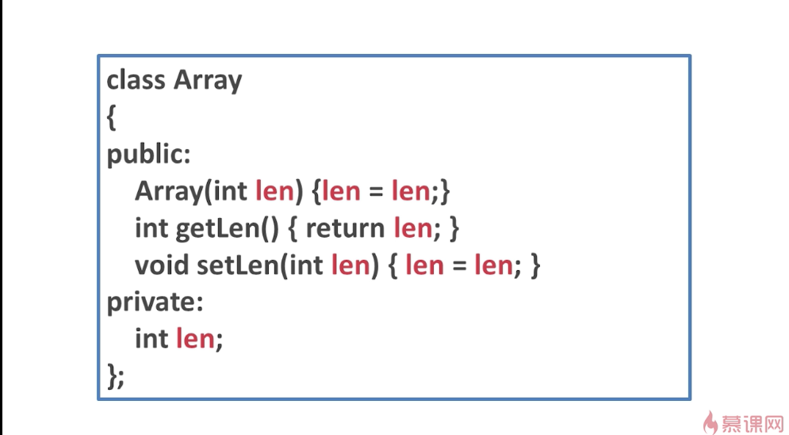
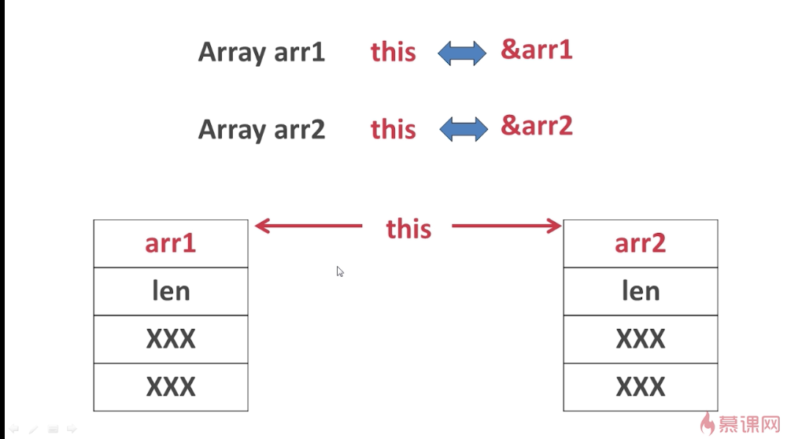
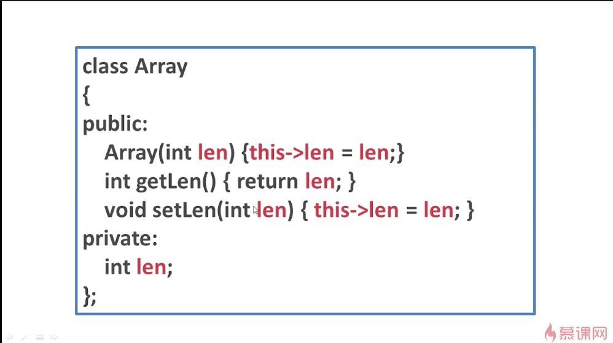
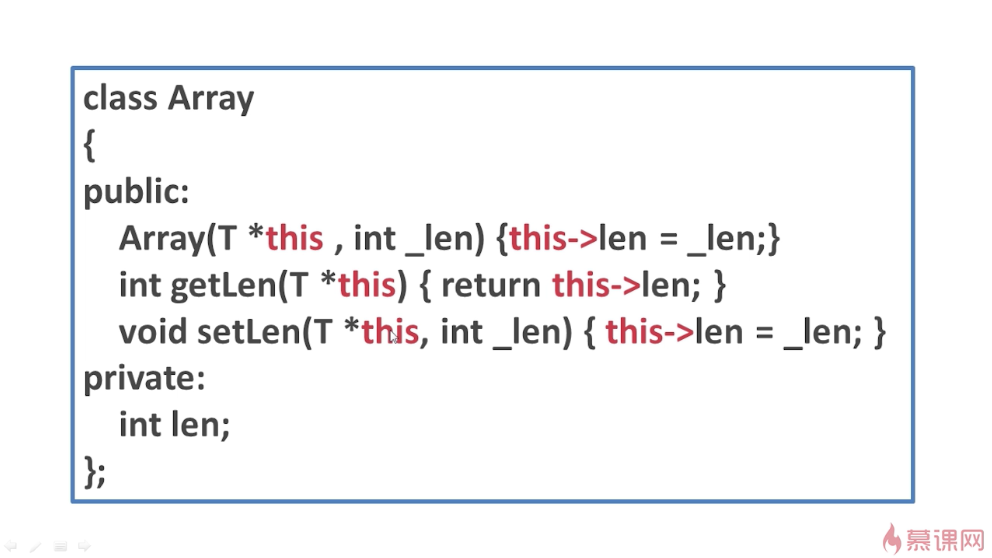
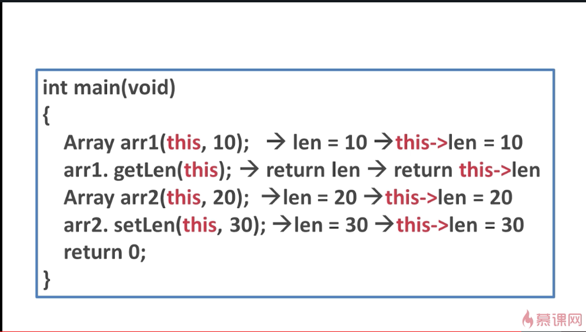

## this指针
例子：

这是一个数组的类，通过观察可以发现参数和数据成员都不同(即_len和len)。
  
如果参数和数据成员同名会怎样呢？(见下面的例子)

在这个例子中，对于构造函数和setLen()，编译器无法分辨哪个是作为参数的len，哪个又是作为数据成员的len，所以认为这是错误的赋值方式。

## ---------------------------------------------------
this指针就是指向对象自身数据的指针。

在刚才的例子中，如果使用Array这个类实例化一个对象arr1，那么this指针就相当于给arr1取地址，也就是说this就是&arr1；如果再实例化一个对象arr2，那么this指针此时就是arr2的地址。如果画图来说，就可以按照上图的下半部分来表示。
如果实例化arr1，那么在内存当中就有这么一段空间。在arr1的空间当中，有len这个数据成员，未来也许还会有其他的数据成员xxx。
如果实例化另外一个对象arr2，那么arr2中也有自己的len，当然，未来也可能有其他的数据成员。
this如果写在arr1里面，就是arr1的地址，写在arr2里面，就是arr2的地址。可见，this要表达什么意思，取决于它在什么位置。通过this指针，可以访问到它表达的对象的自身的任何数据。

将this指针应用到代码当中，可以写成这样：

可以发现，如果想用与数据成员同名的参数，那么就可以在数据成员的前面加上"this->"，来表达数据成员的len，然后将参数的len赋值给数据成员的len。
这样，计算机就分得清，代码也就能编译的过去。

## ---------------------------------------------------
成员函数如何访问到对应的数据成员？
再看一个例子：

当实例化对象并使用成员函数时，this指针就代表着这个对象本身的地址。
Array arr1(this,10);当调用len = 10的时候，就相当于调用this->len = 10。用this去指向len的时候，其实就是指向arr1中的len，也就不会给其他的对象赋错值了。其他语句同理。

回到之前的例子：

其实在编译的时候，编译器自动地为每个成员函数的参数列表都加了一个this指针，因此我们自定义的时候，就不必要加this指针这个参数，使用的时候也可以当作没这回事。
那么系统自动添加的this指针，添加在参数列表的什么位置呢？
详见this指针例子。