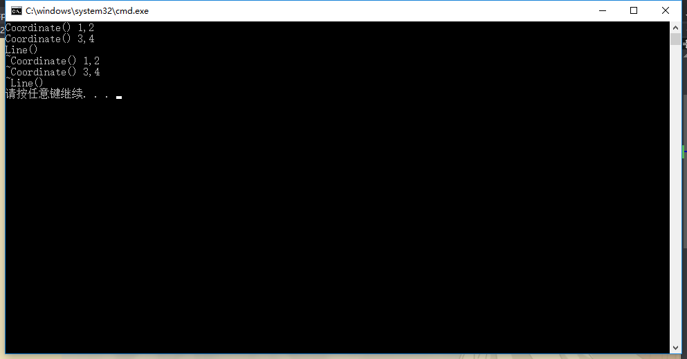
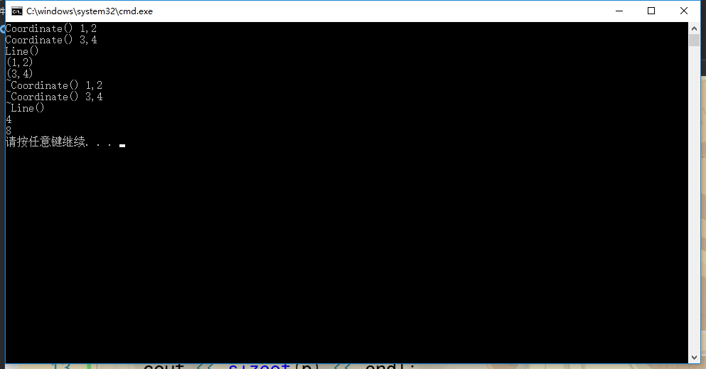

## 对象成员指针例子
要求如下：


Coordinate.h
```h
class Coordinate
{
public:
	Coordinate(int x, int y);
	~Coordinate();
	int getX();
	int getY();
private:
	int m_iX;
	int m_iY;
};
```

Coordinate.cpp
```cpp
#include <iostream>
#include "Coordinate.h"
using namespace std;

Coordinate::Coordinate(int x, int y)
{
	m_iX = x;
	m_iY = y;
	cout << "Coordinate() " << m_iX << "," << m_iY << endl;
}

Coordinate::~Coordinate()
{
	cout << "~Coordinate() " << m_iX << "," << m_iY << endl;
}

int Coordinate::getX()
{
	return m_iX;
}

int Coordinate::getY()
{
	return m_iY;
}
```

Line.h
```h
#include "Coordinate.h"

class Line
{
public:
	Line(int x1, int y1, int x2, int y2);
	~Line();
	void printInfo();
private:
	Coordinate *m_pCoorA;//坐标类的对象指针，一个A点，一个B点。
	Coordinate *m_pCoorB;//它只是一个指针，而不是一个对象。
};
```

Line.cpp
```cpp
#include <iostream>
#include "Line.h"
using namespace std;

Line::Line(int x1, int y1, int x2, int y2)
{
	//因为数据成员是对象指针，所以要在构造函数里面去实例化对象。实例化的时候，需要从堆中去申请内存而实例化这个对象。
	m_pCoorA = new Coordinate(x1, y1);//实例化了两个Coordinate对象
	m_pCoorB = new Coordinate(x2, y2);
	cout << "Line()" << endl;
}

Line::~Line()
{
	delete m_pCoorA;
	m_pCoorA = NULL;
	delete m_pCoorB;
	m_pCoorB = NULL;
	cout << "~Line()" << endl;
}

void Line::printInfo()
{
	cout << "(" << m_pCoorA->getX() << "," << m_pCoorA->getY() << ")" << endl;
	//因为是指针，所以通过"->"来访问相应的数据函数。
	cout << "(" << m_pCoorB->getX() << "," << m_pCoorB->getY() << ")" << endl;
}
```

demo.cpp
```cpp
#include <iostream>
#include <stdlib.h>
#include "Line.h"
using namespace std;

int main()
{
	Line *p = new Line(1,2,3,4);
	
	delete p;
	p = NULL;

	system("pause");
	return 0;
}
```

运行结果如下：



## --------------------------------------------------
将demo.cpp更改如下：
```cpp
#include <iostream>
#include <stdlib.h>
#include "Line.h"
using namespace std;

int main()
{
	Line *p = new Line(1,2,3,4);
	p->printInfo();
	delete p;
	p = NULL;

	cout << sizeof(p) << endl;//指针p的大小
	cout << sizeof(Line) << endl;//Line对象的大小

	system("pause");
	return 0;
}
```

运行结果如下：



即指针p所占的大小是4个基本的内存单元。(32位的编译环境)
64位操作系统，指针占8字节。