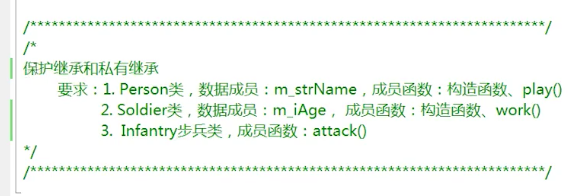
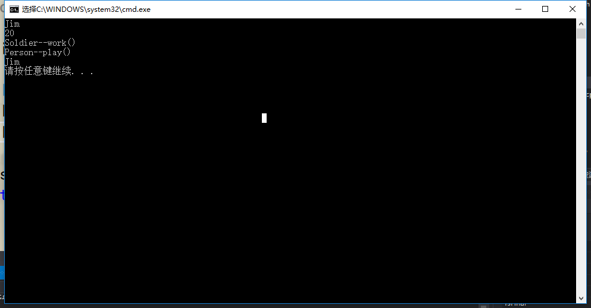
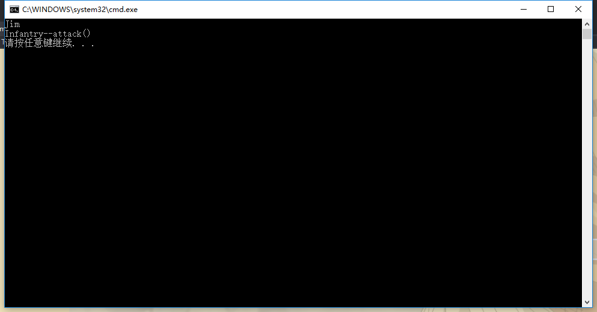

## 保护继承私有继承-例子
### -------------------------------------------------------
### public继承
public成员可以一直public继承下去，被继承后属于public，可以被对象直接访问。
protected成员可以一直public继承下去，被继承后属于protected，不可以被对象直接访问。
private成员不能被public继承。
### protected继承
public成员可以一直protected继承下去，被继承后属于protected，不可以被对象直接访问。
protected成员可以一直protected继承下去，被继承后属于protected，不可以被对象直接访问。
private成员不能被protected继承。
### private继承
public成员只能被private继承一次，被继承后属于private，不可以被对象直接访问。
protected成员只能被private继承一次，被继承后属于private，不可以被对象直接访问。
private成员不能被private继承。
### -------------------------------------------------------
要求：



Person.h
```h
#include <string>
using namespace std;

class Person
{
public:
	Person();
	void play();
protected:
	string m_strName;
};
```

Person.cpp
```cpp
#include "Person.h"
#include <iostream>
using namespace std;

Person::Person()
{
	m_strName = "Merry";
}

void Person::play()
{
	cout << "Person--play()" << endl;
	cout << m_strName << endl;
}
```

Soldier.h
```h
//soldier士兵
#include "Person.h"

class Soldier : public Person
{
public:
	Soldier();
	void work();
protected:
	int m_iAge;
};
```

Soldier.cpp
```cpp
#include <iostream>
#include "Soldier.h"
using namespace std;

Soldier::Soldier()
{
}

void Soldier::work()
{
	m_strName = "Jim";
	m_iAge = 20;
	cout << m_strName << endl;
	cout << m_iAge << endl;
	cout << "Soldier--work()" << endl;
}
```

Infantry.h
```h
//infantry步兵
#include "Soldier.h"

class Infantry : public Soldier
{
public:
	void attack();
};
```

Infantry.cpp
```cpp
#include <iostream>
#include "Infantry.h"
using namespace std;

void Infantry::attack()
{
	cout << "Infantry--attack()" << endl;
}
```

demo.cpp
```cpp
#include <iostream>
#include <stdlib.h>
#include "Soldier.h"

int main()
{
	Soldier soldier;
	soldier.work();
	soldier.play();

	system("pause");
	return 0;
}
```

运行结果：



### -------------------------------------------------------
Soldier.h
```h
//soldier士兵
#include "Person.h"

class Soldier : protected Person//change
{
public:
	Soldier();
	void work();
protected:
	int m_iAge;
};
```

demo.cpp
```cpp
#include <iostream>
#include <stdlib.h>
#include "Soldier.h"

int main()
{
	Soldier soldier;
	soldier.work();//正常
	soldier.play();//出现问题

	system("pause");
	return 0;
}
```

当进行protected继承之后，在基类当中的play()无法被子类的对象直接调用。

### -------------------------------------------------------
Infantry.cpp
```cpp
#include <iostream>
#include "Infantry.h"
using namespace std;

void Infantry::attack()
{
	m_strName = "Jim";//+
	cout << m_strName << endl;//+
	cout << "Infantry--attack()" << endl;
}
```

demo.cpp
```cpp
#include <iostream>
#include <stdlib.h>
#include "Infantry.h"

int main()
{
	Infantry soldier;
	soldier.attack();

	system("pause");
	return 0;
}
```

运行结果：



说明了Person类当中的public下和protected下的数据成员和成员函数被继承到了Soldier的protected的下面。

### -------------------------------------------------------
Soldier.h
```h
//soldier士兵
#include "Person.h"

class Soldier : private Person//change
{
public:
	Soldier();
	void work();
protected:
	int m_iAge;
};
```

程序报错，m_strName不能够在Infantry这个类的成员函数(attack())当中去直接访问。

### 小总结
继承都是继承所有的数据成员和成员函数，只是能不能访问的问题。