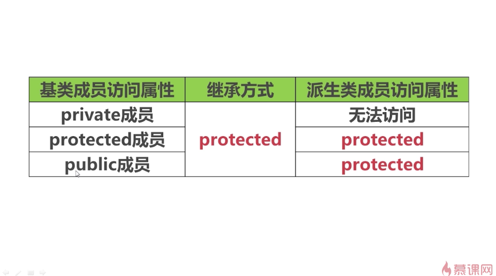
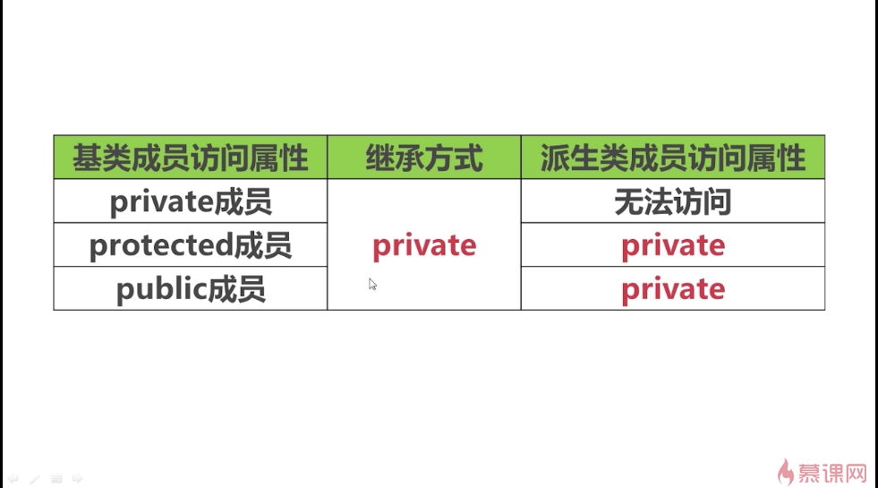

## 保护继承私有继承

保护继承

私有继承

### -------------------------------------------------------
线段类中只能访问到坐标类的公有数据成员/成员函数——“Has a”关系，私有继承是Has a的一种
### 总结
private不能继承、类外不能访问。
protected能继承，类外不能访问。
public能继承、类外能访问。
权限：类外访问 < 继承 < 类内访问。