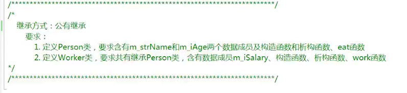
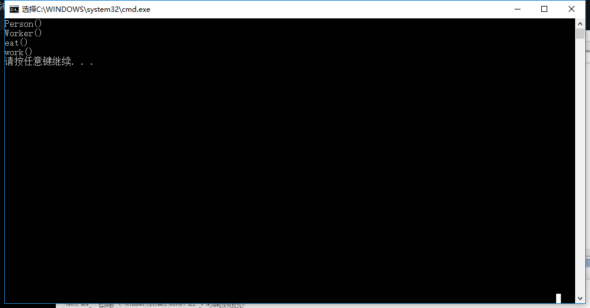
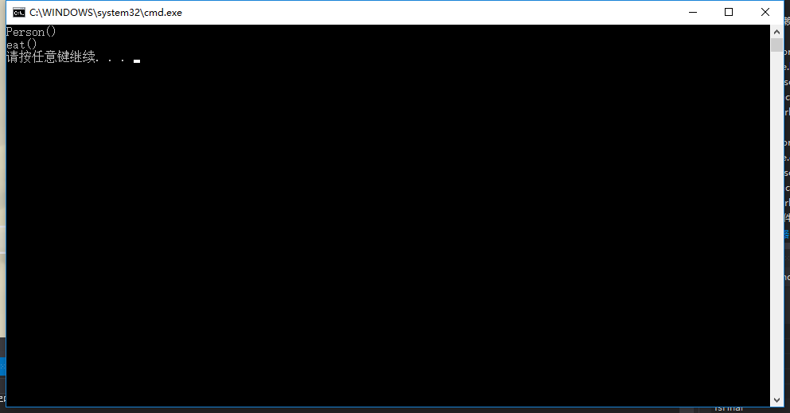
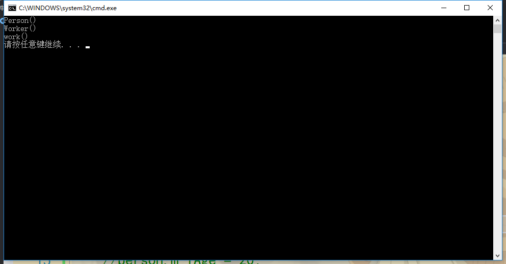

## 公有继承-例子
要求：



Person.h
```h
#include <string>
using namespace std;

class Person
{
public:
	Person();
	~Person();
	void eat();
	string m_strName;
	int m_iAge;
};
```

Person.cpp
```cpp
#include "Person.h"
#include <iostream>
using namespace std;

Person::Person()
{
	cout << "Person()" << endl;
}

Person::~Person()
{
	cout << "~Person()" << endl;
}

void Person::eat()
{
	cout << "eat()" << endl;
}
```

Worker.h
```h
#include "Person.h"

class Worker : public Person
{
public:
	Worker();
	~Worker();
	void work();
	int m_iSalary;
};
```

Worker.cpp
```cpp
#include "Worker.h"
#include <iostream>
using namespace std;

Worker::Worker()
{
	cout << "Worker()" << endl;
}

Worker::~Worker()
{
	cout << "~Worker()" << endl;
}

void Worker::work()
{
	cout << "work()" << endl;
}
```

demo.cpp
```cpp
#include "Worker.h"
#include <iostream>
#include <stdlib.h>
using namespace std;

int main()
{
	Worker *p = new Worker();//从堆中实例化对象
	p->m_strName = "Jim";
	p->m_iAge = 10;
	p->eat();
	p->m_iSalary = 1200;
	p->work();

	delete p;
	p = NULL;

	system("pause");
	return 0;
}
```

### -------------------------------------------------------
将demo.cpp改成：
```cpp
#include "Worker.h"
#include <iostream>
#include <stdlib.h>
using namespace std;

int main()
{
	Worker worker;//从栈中实例化
	worker.m_strName = "Jim";
	worker.m_iAge = 10;
	worker.eat();
	worker.m_iSalary = 1200;
	worker.work();

	system("pause");
	return 0;
}
```

运行结果：



说明了在公共继承的情况下，父类的public访问限定符下的数据成员和成员函数被继承到了子类的public访问限定符下。

### -------------------------------------------------------
Person.h
```h
#include <string>
using namespace std;

class Person
{
public:
	Person();
	~Person();
	void eat();
protected://+
	string m_strName;
private://+
	int m_iAge;
};
```

Person.cpp
```cpp
#include "Person.h"
#include <iostream>
using namespace std;

Person::Person()
{
	cout << "Person()" << endl;
}

Person::~Person()
{
	cout << "~Person()" << endl;
}

void Person::eat()
{
	m_strName = "Jim";//+
	m_iAge = 20;//+
	cout << "eat()" << endl;
}
```

demo.cpp
```cpp
//#include "Worker.h"
#include <iostream>
#include <stdlib.h>
#include "Person.h"//+
using namespace std;

int main()
{
	/*Worker worker;
	worker.m_strName = "Jim";
	worker.m_iAge = 10;
	worker.eat();
	worker.m_iSalary = 1200;
	worker.work();*/
	//ctrl+k+c注释掉多行代码

	Person person;

	person.eat();

	system("pause");
	return 0;
}
```

运行结果：



说明了在protected下面和private下面定义的数据成员在eat()的成员函数当中访问效果是等价的。

### -------------------------------------------------------
再将demo.cpp改成：
```cpp
//#include "Worker.h"
#include <iostream>
#include <stdlib.h>
#include "Person.h"//+
using namespace std;

int main()
{
	/*Worker worker;
	worker.m_strName = "Jim";
	worker.m_iAge = 10;
	worker.eat();
	worker.m_iSalary = 1200;
	worker.work();*/
	//ctrl+k+c注释掉多行代码

	Person person;
	person.m_strName = "Merry";
	person.m_iAge = 20;
	//person.eat();

	system("pause");
	return 0;
}
```

程序报错，说明作为protected的数据成员来说，没有办法在main函数当中通过外部对象直接访问到。同样的，也不能访问private的数据成员。

### -------------------------------------------------------
接下来说说公有继承之后父类的protected下的数据成员，虽然被子类继承，却无法直接使用的情况。
Person.h
```h
#include <string>
using namespace std;

class Person
{
public:
	Person();
	~Person();
	void eat();
protected:
	string m_strName;
	int m_iAge;
};
```

Worker.cpp
```cpp
#include "Worker.h"
#include <iostream>
using namespace std;

Worker::Worker()
{
	cout << "Worker()" << endl;
}

Worker::~Worker()
{
	cout << "~Worker()" << endl;
}

void Worker::work()
{
	m_strName = "Jim";//+
	m_iAge = 30;//+
	cout << "work()" << endl;
}
```

demo.cpp
```cpp
#include "Worker.h"
#include <iostream>
#include <stdlib.h>
//#include "Person.h"
using namespace std;

int main()
{
	Worker worker;
	worker.work();
	//ctrl+k+u解除掉注释过的多行代码

	//Person person;
	//person.m_strName = "Merry";
	//person.m_iAge = 20;
	//person.eat();

	system("pause");
	return 0;
}
```

运行结果：



说明了Person当中的protected数据成员被继承到了Worker的protected下面。

### -------------------------------------------------------
Person.h改成：
```h
#include <string>
using namespace std;

class Person
{
public:
	Person();
	~Person();
	void eat();
private://change
	string m_strName;
	int m_iAge;
};
```

运行失败。