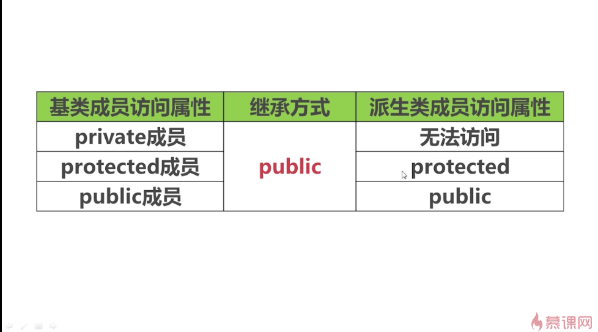

## 公有继承
继承有三种方式：

这里先讲公有继承。
### -------------------------------------------------------
例子：

使用时：

worker类的对象可以访问Person类的数据成员和成员函数。

### -------------------------------------------------------
protected访问限定符下的继承特性

例子：

protected和private还可以作为访问限定符。在这个例子中，使用时红色语句是错误的。

当去实现成员函数eat()时，在函数当中去访问名字、年龄这两个数据成员的时候，是可以正常访问的。

此时，Worker继承了Person，public访问限定符下的数据就会继承到public下面，protected下面的数据就会继承到protected下面。

### -------------------------------------------------------
private访问限定符下的继承特性

例子：

private下面的数据成员被继承到了Worker下面的不可见位置，而不是private下面。因此，在Worker中使用m_iAge就是不对的。

### 总结

