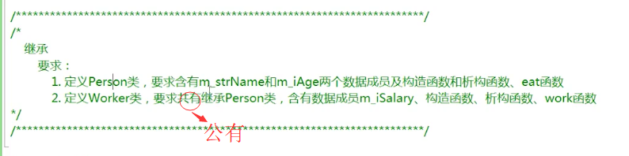
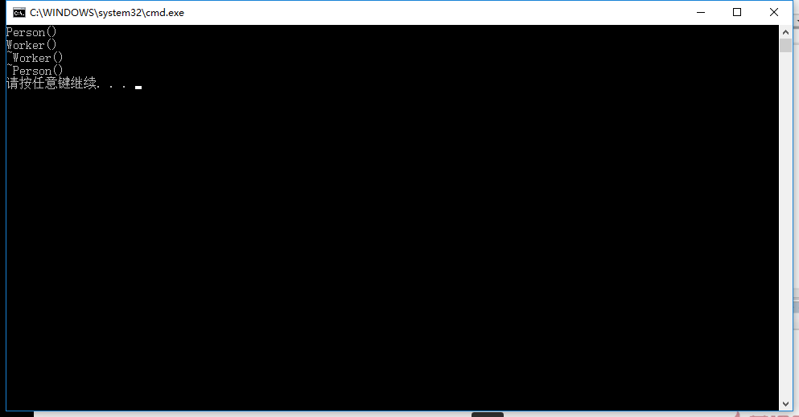
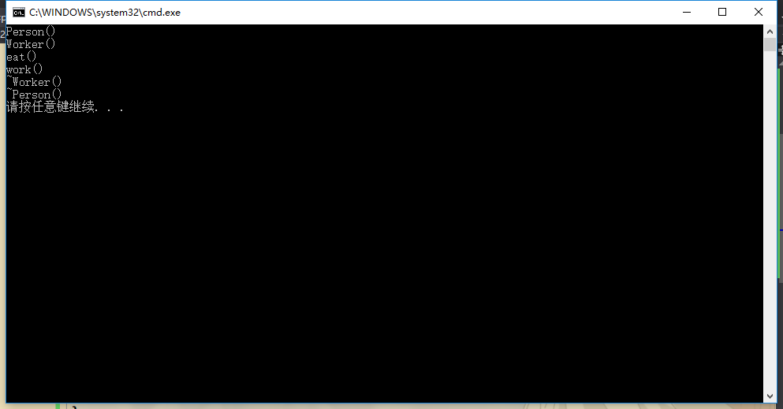

## 为什么继承-例子
要求：



Person.h
```h
#include <string>
using namespace std;

class Person
{
public:
	Person();
	~Person();
	void eat();
	string m_strName;
	int m_iAge;
};
```

Person.cpp
```cpp
#include "Person.h"
#include <iostream>
using namespace std;

Person::Person()
{
	cout << "Person()" << endl;
}

Person::~Person()
{
	cout << "~Person()" << endl;
}

void Person::eat()
{
	cout << "eat()" << endl;
}
```

Worker.h
```h
#include "Person.h" //因为要继承Person类，所以包含。

class Worker : public Person
{
public:
	Worker();
	~Worker();
	void work();
	int m_iSalary;
};
```

Worker.cpp
```cpp
#include <iostream>
#include "Worker.h"
using namespace std;

Worker::Worker()
{
	cout << "Worker()" << endl;
}

Worker::~Worker()
{
	cout << "~Worker()" << endl;
}

void Worker::work()
{
	cout << "work()" << endl;
}
```

demo.cpp
```cpp
#include <iostream>
#include <stdlib.h>
#include "Worker.h"
using namespace std;

int main()
{
	Worker *p = new Worker();
	delete p;
	p = NULL;

	system("pause");
	return 0;
}
```

运行结果：



可见，要想实例化一个子类，必然要先实例化基类（这种实例化是隐性的）。销毁的时候，先执行Worker的析构函数，再执行父类的析构函数。

## ----------------------------------------------------
将demo.cpp代码更改成：
```cpp
#include <iostream>
#include <stdlib.h>
#include "Worker.h"
using namespace std;

int main()
{
	Worker *p = new Worker();
	p->m_strName = "Jim";
	p->m_iAge = 10;
	p->eat();
	p->m_iSalary = 1200;
	p->work();

	delete p;
	p = NULL;

	system("pause");
	return 0;
}
```

运行结果：



可见，子类可以访问父类的成员函数和数据成员，它自己的成员函数和数据成员也可以正确的访问。