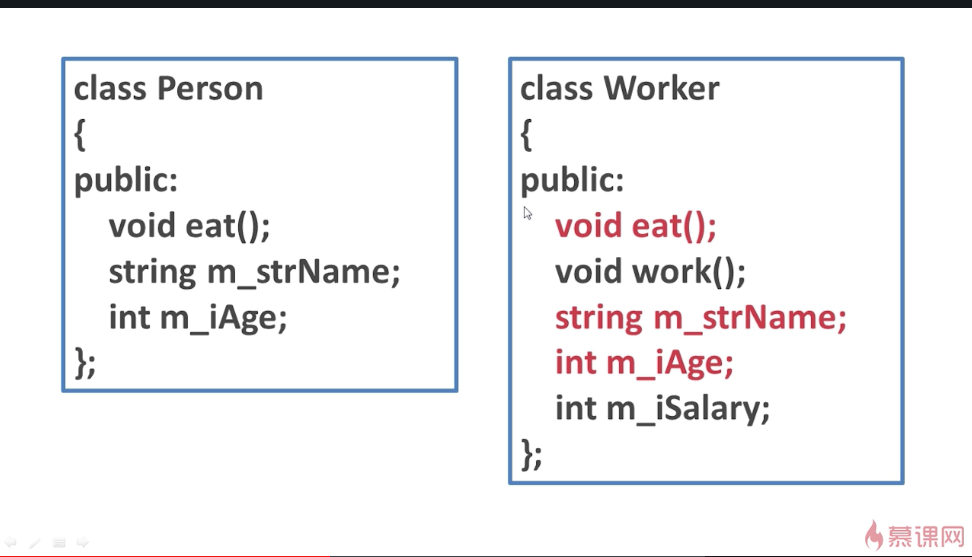
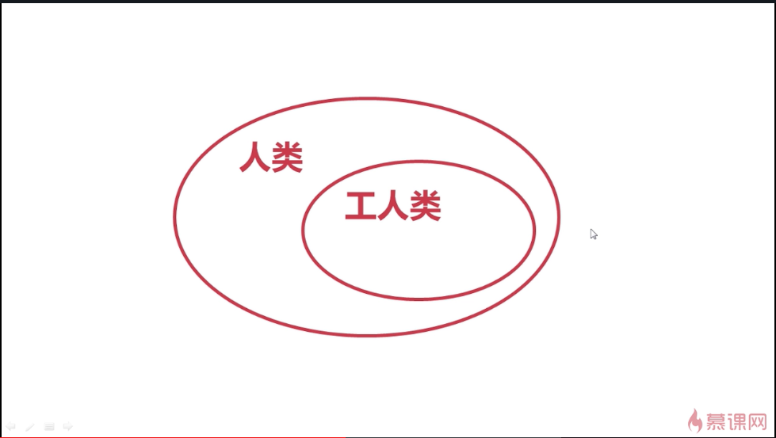
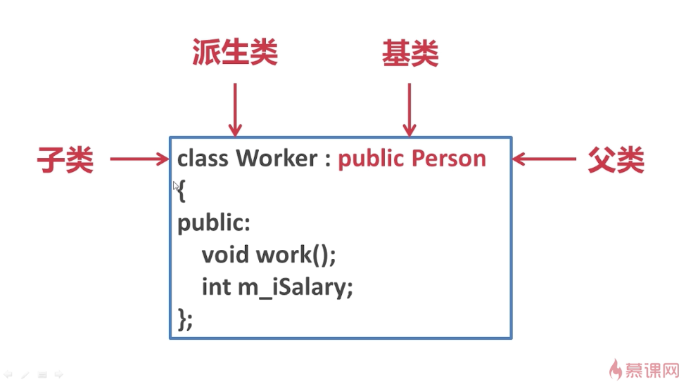
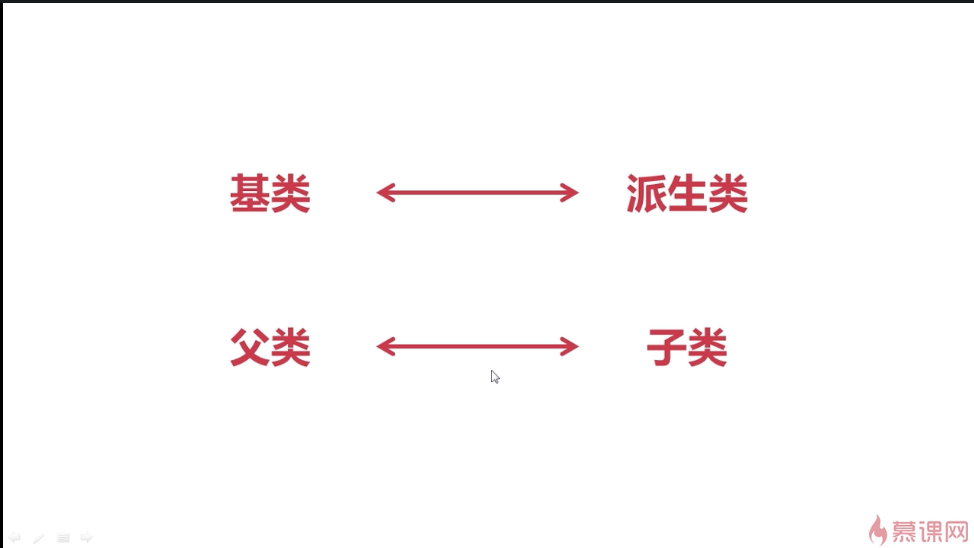
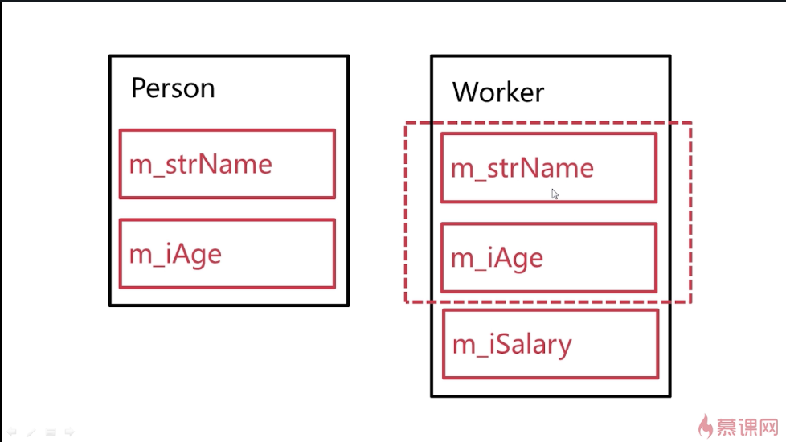

## 为什么继承
从一个例子讲起：

定义了人这个类和工人这个类，工人是人的一种。所以肯定也有名字、年龄、吃。

人类是工人类的超集，工人类是人类的子集。

有了这样的概念关系，就可以将程序优化成下面这样：

public是一种继承方式，这样写了以后，工人类的定义里面就不需要写人类中的内容了，只需要写出自己特有的内容就行了。

写成这样的继承关系后，可以说工人类是人类的派生类或子类，人类是工人类的基类或父类。

配套使用，不要混搭。

## --------------------------------------------------
在内存中的关系：

实例化后，Person类有两个数据成员，Worker类虽然没在定义中写Person类中的相关定义，但是还是有3个数据成员。