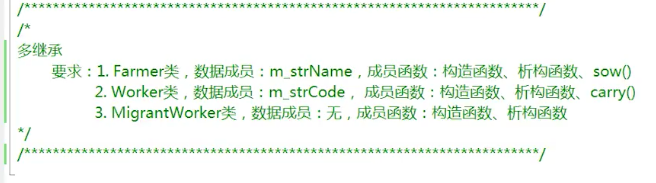
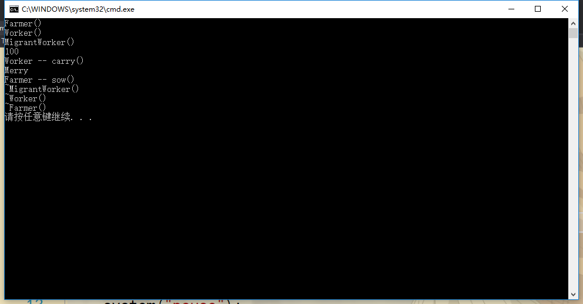

## 多继承-例子



Worker.h
```h
#include <string>
using namespace std;

class Worker
{
public:
	Worker(string code = "001");
	virtual ~Worker();
	void carry();
protected:
	string m_strCode;
};
```

Worker.cpp
```cpp
#include <iostream>
#include "Worker.h"
using namespace std;

Worker::Worker(string code)
{
	m_strCode = code;
	cout << "Worker()" << endl;
}

Worker::~Worker()
{
	cout << "~Worker()" << endl;
}

void Worker::carry()
{
	cout << m_strCode << endl;
	cout << "Worker -- carry()" << endl;
}
```

Farmer.h
```h
#include <string>
using namespace std;

class Farmer
{
public:
	Farmer(string name = "Jack");
	virtual ~Farmer();
	void sow();
protected:
	string m_strName;
};
```

Farmer.cpp
```cpp
#include "Farmer.h"
#include <iostream>
using namespace std;

Farmer::Farmer(string name)
{
	m_strName = name;
	cout << "Farmer()" << endl;
}

Farmer::~Farmer()
{
	cout << "~Farmer()" << endl;
}

void Farmer::sow()
{
	cout << m_strName << endl;
	cout << "Farmer -- sow()" << endl;
}
```

MigrantWorker.h
```h
#include <string>
#include "Worker.h"
#include "Farmer.h"
using namespace std;

class MigrantWorker : public Farmer, public Worker
{
public:
	MigrantWorker(string name, string code);
	~MigrantWorker();
};
```

MigrantWorker.cpp
```cpp
#include "MigrantWorker.h"
#include <iostream>
using namespace std;

MigrantWorker::MigrantWorker(string name, string code) :Farmer(name), Worker(code)
{
	cout << "MigrantWorker()" << endl;
}

MigrantWorker::~MigrantWorker()
{
	cout << "~MigrantWorker()" << endl;
}
```

demo.cpp
```cpp
#include <iostream>
#include <stdlib.h>
#include "MigrantWorker.h"

int main()
{
	MigrantWorker *p = new MigrantWorker("Merry", "100");
	p->carry();
	p->sow();
	delete p;
	p = NULL;
	
	system("pause");
	return 0;
}
```

运行结果：



按继承的声明顺序来构造基类的。

c++对象的初始化顺序是:

    (a) 基类初始化

    (b) 对象成员初时化

    (c) 构造函数的赋值语句

假设
```cpp
class C :  public A, public B 
{
	D d;

}
```

则初始化的顺序是A, B, D, C的构造函数. 这里基类的初始化顺序是按照声明的顺序, 成员对象也是按照声明的顺序. 因此 c(int i, int j) : B(i), A(j) {} //这里成员初始化列表的顺序是不起作用的

析构函数的顺序则刚好是调过来, 构造/析构顺序可看作是一种栈的顺序