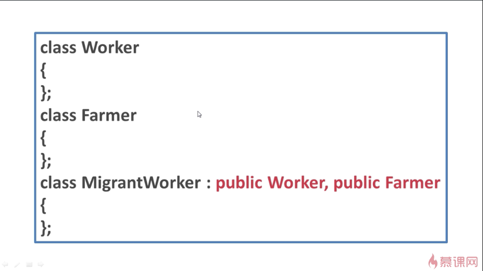

## 多继承与多重继承
### ---多重继承

士兵类继承了人类，步兵类继承了士兵类，那么就称这三个类之间存在着多重继承关系。如果这三个类在继承的时候，都使用的是public公有继承，那么它们也存在着以下的关系：

士兵是一个人，步兵是一个士兵，步兵也是一个人。体现到代码，可以这样来写：

这就是*多重继承*。

### ---多继承

农民工类即继承了工人类，又继承了农民类。这样的一种关系就称之为*多继承*。

在多继承的关系下，如果农民工类在继承工人类和农民类的时候都是以public公有继承的方式继承的，那么它们还存在着以下的关系：

农民工是一个工人，农民工是一个农民，但是工人和农民这两个类本身是平行的。具体到代码层面：

如果不写public，系统会默认为进行的是private私有的继承。