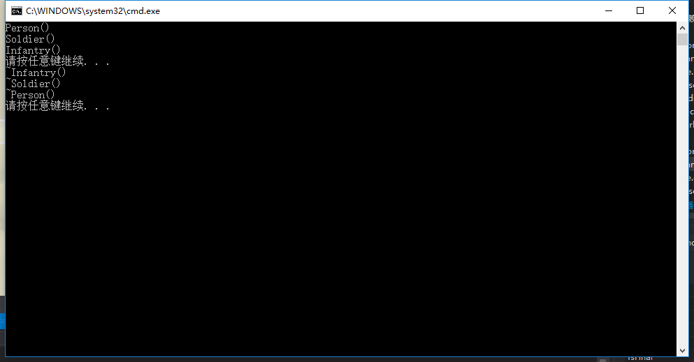

## 多重继承-例子


Person.h
```h
#include <string>
using namespace std;

class Person
{
public:
	Person(string name = "Jim");
	virtual ~Person();
	void play();
protected:
	string m_strName;
};
```

Person.cpp
```cpp
#include "Person.h"
#include <iostream>
using namespace std;

Person::Person(string name)
{
	m_strName = name;
	cout << "Person()" << endl;
}

Person::~Person()
{
	cout << "~Person()" << endl;
}

void Person::play()
{
	cout << "Person -- play()" << endl;
	cout << m_strName << endl;
}
```

Soldier.h
```h
#include "Person.h"

class Soldier : public Person
{
public:
	Soldier(string name ="James", int age = 20);
	virtual ~Soldier();
	void work();
protected:
	int m_iAge;
};
```

Soldier.cpp
```cpp
#include <iostream>
#include "Soldier.h"
using namespace std;

Soldier::Soldier(string name, int age)
{
	m_strName = name;
	m_iAge = age;
	cout << "Soldier()" << endl;
}

Soldier::~Soldier()
{
	cout << "~Soldier()" << endl;
}

void Soldier::work()
{
	cout << m_strName << endl;
	cout << m_iAge << endl;
	cout << "Soldier -- work()" << endl;
}
```

Infantry.h
```h
#include "Soldier.h"

class Infantry : public Soldier
{
public:
	Infantry(string name = "Jack", int age = 30);
	~Infantry();
	void attack();
};
```

Infantry.cpp
```cpp
#include <iostream>
#include "Infantry.h"
using namespace std;

Infantry::Infantry(string name, int age)
{
	m_strName = name;
	m_iAge = age;
	cout << "Infantry()" << endl;
}

Infantry::~Infantry()
{
	cout << "~Infantry()" << endl;
}

void Infantry::attack()
{
	cout << m_strName << endl;
	cout << m_iAge << endl;
	cout << "Infantry -- attack()" << endl;
}
```

demo.cpp
```cpp
#include <iostream>
#include <stdlib.h>
#include "Infantry.h"

void test1(Person p)
{
	p.play();
}

void test2(Person &p)
{
	p.play();
}

void test3(Person *p)
{
	p->play();
}

int main()
{
	Infantry infantry;
	
	system("pause");
	return 0;
}
```

运行结果：



意味着先执行了Person的构造函数，然后执行了Soldier的构造函数，最后执行了Infantry的构造函数。

### ----------------------------------------------------------------
将demo.cpp的代码改为：
```cpp
#include <iostream>
#include <stdlib.h>
#include "Infantry.h"

void test1(Person p)
{
	p.play();
}

void test2(Person &p)
{
	p.play();
}

void test3(Person *p)
{
	p->play();
}

int main()
{
	Infantry infantry;
	test1(infantry);
	test2(infantry);
	test3(&infantry);
	
	system("pause");
	return 0;
}
```

运行结果：


无论继承层级有多少层，它们只要保持着直接或者间接的继承关系，那么子类都可以和自己的直接父类或间接父类称之为is-a的关系，并且能够通过父类的指针对直接子类或间接子类的对象进行相应的操作。