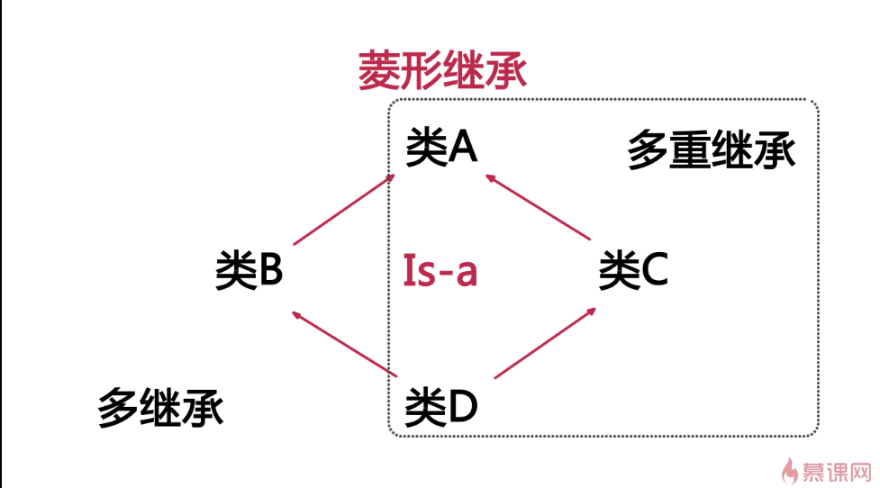

## 虚继承
例子：

生活中的例子：

那么问题来了，当我们要实例化D的对象的时候，D是从B继承来的，B是从A继承来的；D又是从C继承来的，C是从A继承来的。这样的话，D中将会含有两个完全一样的A的数据，这样的数据是冗余的，不能容忍。

那么怎么解决呢？

需要用到虚继承。

### ----------------------------------------------------------------

也可以写在public后面，将Worker这个类称为虚继类。

在使用的时候，MigrantWorker当中就只含有一个Person类的数据。