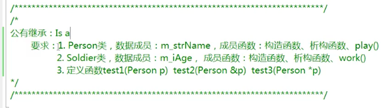
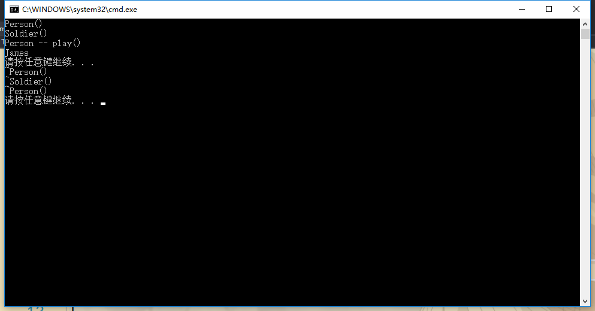
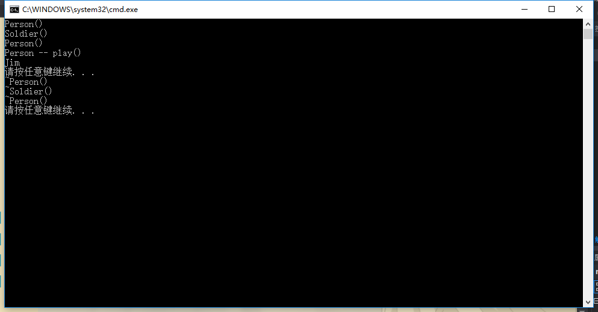
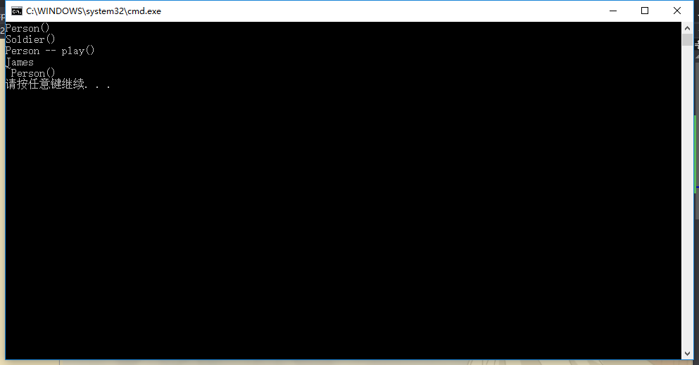
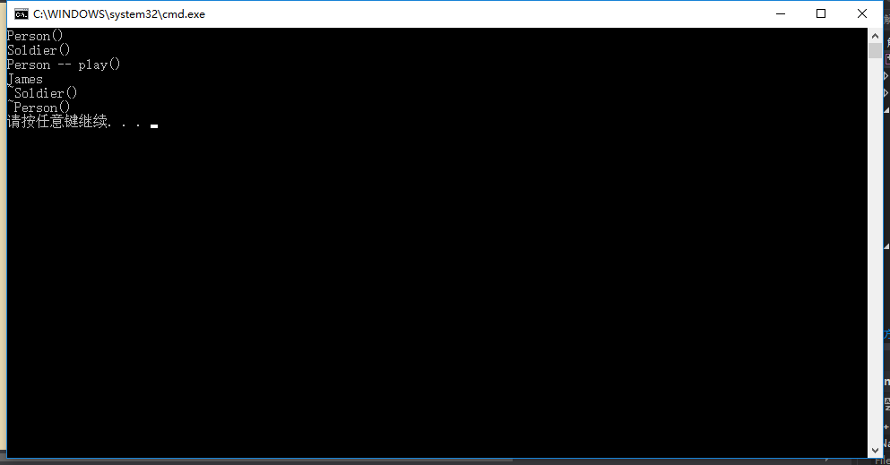
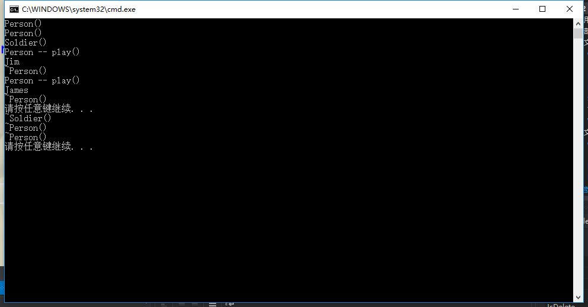
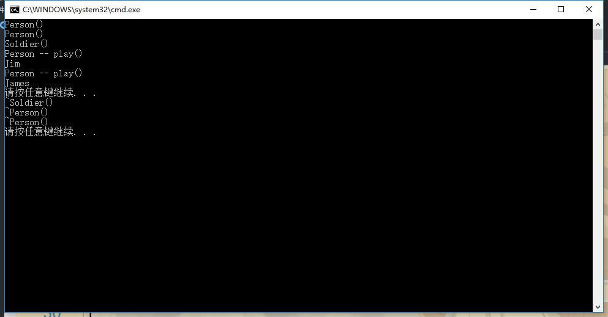

## isA-例子



test1(Person p)它的参数是Person的一个对象。
test2(Person &p)它的参数是Person的一个引用。
test3(Person *p)它的参数是Person的一个指针。

Person.h
```h
#include <string>
using namespace std;

class Person
{
public:
	Person(string name = "Jim");
	~Person();
	void play();
protected:
	string m_strName;
};
```

Person.cpp
```cpp
#include "Person.h"
#include <iostream>
using namespace std;

Person::Person(string name)
{
	m_strName = name;
	cout << "Person()" << endl;
}

Person::~Person()
{
	cout << "~Person()" << endl;
}

void Person::play()
{
	cout << "Person -- play()" << endl;
	cout << m_strName << endl;
}
```

Soldier.h
```h
#include "Person.h"

class Soldier : public Person
{
public:
	Soldier(string name ="James", int age = 20);
	~Soldier();
	void work();
protected:
	int m_iAge;
};
```

Soldier.cpp
```cpp
#include <iostream>
#include "Soldier.h"
using namespace std;

Soldier::Soldier(string name, int age)
{
	m_strName = name;
	m_iAge = age;
	cout << "Soldier()" << endl;
}

Soldier::~Soldier()
{
	cout << "~Soldier()" << endl;
}

void Soldier::work()
{
	cout << m_strName << endl;
	cout << m_iAge << endl;
	cout << "Soldier -- work()" << endl;
}
```

demo.cpp
```cpp
#include <iostream>
#include <stdlib.h>
#include "Soldier.h"

int main()
{
	Soldier soldier;
	Person p = soldier;
	p.play();
	
	system("pause");
	return 0;
}
```

运行结果：



可以看到，因为soldier是子类，所以在执行子类的构造函数之前先执行父类的构造函数Person()。

### ----------------------------------------------------------------
将demo.cpp代码改成：
```cpp
#include <iostream>
#include <stdlib.h>
#include "Soldier.h"

int main()
{
	Soldier soldier;
	Person p;
	p.play();
	
	system("pause");
	return 0;
}
```

运行结果：



### ----------------------------------------------------------------
将demo.cpp代码改成：
```cpp
#include <iostream>
#include <stdlib.h>
#include "Soldier.h"

int main()
{
	Soldier soldier;
	Person p;
	p = soldier;
	p.play();
	
	system("pause");
	return 0;
}
```

运行结果：


说明，无论是用soldier去初始化p这个对象还是将soldier直接赋值给p这个对象，都能够将soldier当中的m_strName赋值给p的m_strName。

### ----------------------------------------------------------------
将demo.cpp代码改成：
```cpp
#include <iostream>
#include <stdlib.h>
#include "Soldier.h"

int main()
{
	Soldier soldier;
	Person *p = &soldier;
	p->play();
	
	system("pause");
	return 0;
}
```

运行结果：


可见，无论是用对象赋值的方式还是指针指向的方式，如果是用父类去接收或者指向子类对象的值，那么打印出来的都是子类对象所拥有的值。

### ----------------------------------------------------------------
将demo.cpp代码改成：
```cpp
#include <iostream>
#include <stdlib.h>
#include "Soldier.h"

int main()
{
	Soldier soldier;
	Person *p = &soldier;
	p->play();
	p->work();
	
	system("pause");
	return 0;
}
```

程序报错，可见使用Person的对象或指针只能调用Person自有的数据成员和成员函数，无法调用它子类独有的数据成员和成员函数。

### ----------------------------------------------------------------
将demo.cpp代码改成：
```cpp
#include <iostream>
#include <stdlib.h>
#include "Soldier.h"

int main()
{
	Person *p = new Soldier;//通过Person的指针指向从堆中分配来
	                                        //的Soldier的对象。
	p->play();

	delete p;
	p = NULL;
	
	system("pause");
	return 0;
}
```

运行结果：



可以看到，当我们用父类的指针去指向子类的一个对象的时候，那么子类的这个对象会去实例化，所以实例化的过程会先调用父类的构造函数，再调用子类的构造函数。

但是当销毁的时候，可以发现，只执行了父类的析构函数，子类的析构函数没有被执行，就有可能造成内存的泄漏。

在这种情况下，如何避免内存的泄漏呢？

使用虚的析构函数。当存在继承关系的时候，我们使用父类的指针去指向堆中的子类的对象，并且还想使用父类的指针去释放这块内存，此时需要虚析构函数。写作virtual ~Person();当写上关键字virtual之后，这个关键字是可以被继承下去的。

将Person.h修改为：
```h
#include <string>
using namespace std;

class Person
{
public:
	Person(string name = "Jim");
	virtual ~Person();
	void play();
protected:
	string m_strName;
};
```

也就是说，Soldier.h中~Soldier()此时即使不写成virtual ~Soldier()也是虚析构函数。希望都写上。
这样，就可以成功释放，避免内存泄漏了。

运行结果：



### test1的情况-------------------------------------------------
将demo.cpp代码改成：
```cpp
#include <iostream>
#include <stdlib.h>
#include "Soldier.h"

void test1(Person p)
{
	p.play();
}

void test2(Person &p)
{
	p.play();
}

void test3(Person *p)
{
	p->play();
}

int main()
{
	Person p;
	Soldier s;

	test1(p);
	test1(s);
	
	system("pause");
	return 0;
}
```

运行结果：



第一行Person()是因为通过Person p;调用了Person的构造函数，

第二、三行是因为通过Soldier s调用了Person的构造函数和Soldier的构造函数。

使用test1的时候，因为定义的是test1(Person p)，所以传值的时候会先实例化一个临时对象p，通过这个临时对象p来调用play()，并且在test1()执行完之后，p就会被销毁。这就是为什么会打印出两次~Person()。这两次~Person()都是在test1()被调用完之后被打印出来的。就意味着test1()当中的临时对象p被销毁掉了。

当传入Person类对象的时候，即test1(p)，打印的是Jim。

当传入Soldier类对象的时候，即test1(s)，打印的是James。

可见，如果函数的参数是基类的对象，那么基类的对象和派生类的对象都可以作为实参传递进来，并且能够正常的使用。

### test2的情况-------------------------------------------------
将demo.cpp代码改成：
```cpp
#include <iostream>
#include <stdlib.h>
#include "Soldier.h"

void test1(Person p)
{
	p.play();
}

void test2(Person &p)
{
	p.play();
}

void test3(Person *p)
{
	p->play();
}

int main()
{
	Person p;
	Soldier s;

	test2(p);
	test2(s);
	
	system("pause");
	return 0;
}
```

运行结果：



test2(Person &p)因为参数是个引用，所以在传入参数的时候会将这个参数起一个别名p，通过别名p来调用play()。这个过程当中，并没有实例化临时对象，所以也没有销毁临时对象的痕迹。其它的打印结果和使用test1时是一样的，这说明使用基类的引用也可以接收基类的对象以及派生类的对象。

### test3的情况-------------------------------------------------
将demo.cpp代码改成：
```cpp
#include <iostream>
#include <stdlib.h>
#include "Soldier.h"

void test1(Person p)
{
	p.play();
}

void test2(Person &p)
{
	p.play();
}

void test3(Person *p)
{
	p->play();
}

int main()
{
	Person p;
	Soldier s;

	test3(&p);
	test3(&s);
	
	system("pause");
	return 0;
}
```

运行结果：


它与test2()调用出来的结果是一样的。这是因为test3(Person *p)它的参数是一个指针。这个指针是一个基类的指针，当使用基类或者是派生类的对象地址传入之后，会使用指针p分别调用基类或派生类的play()，所以打印出Jim和James。

### 小总结
通过test1()、test2()、test3()的对比调用，可以发现，使用test2()和test3()并不会产生新的临时变量，所以效率更高。