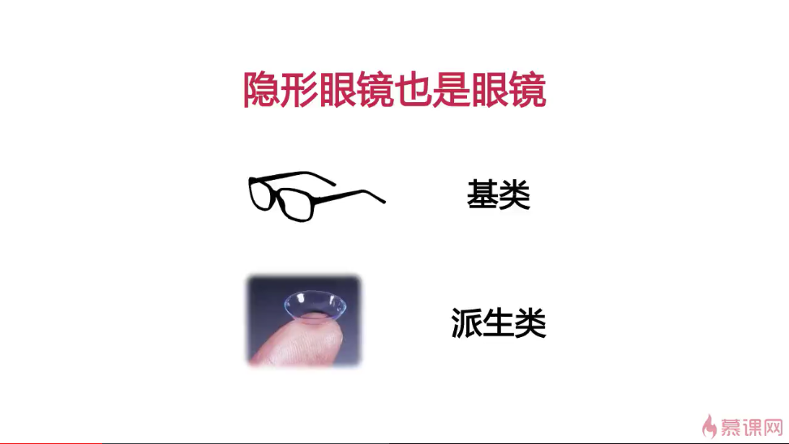
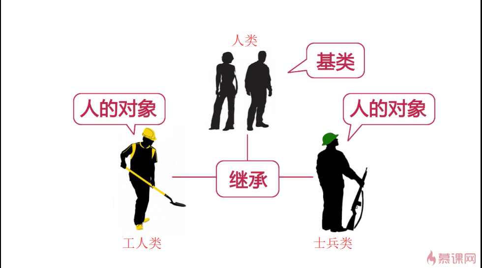
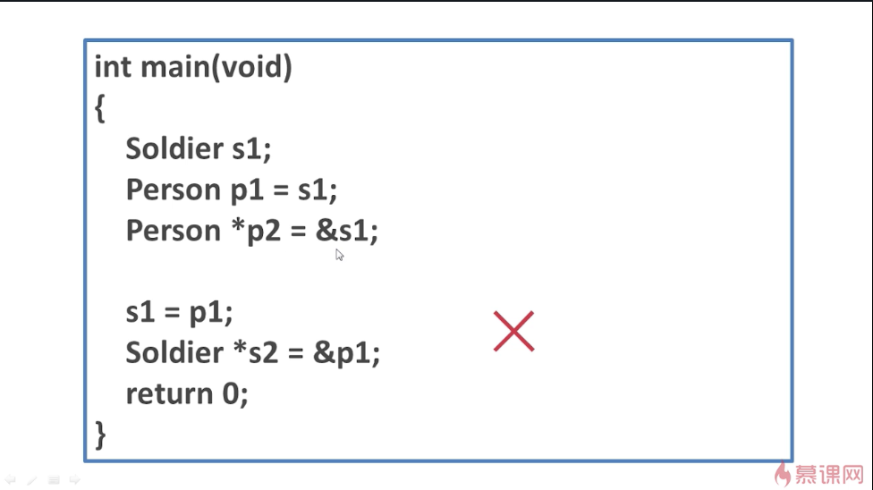
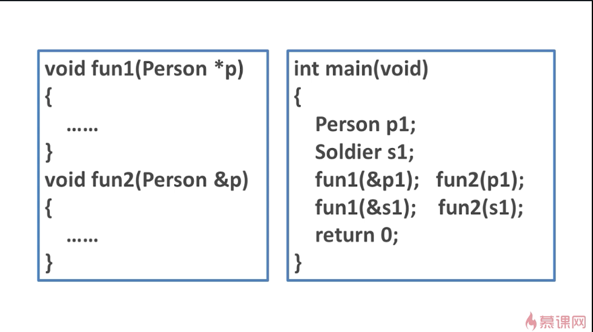
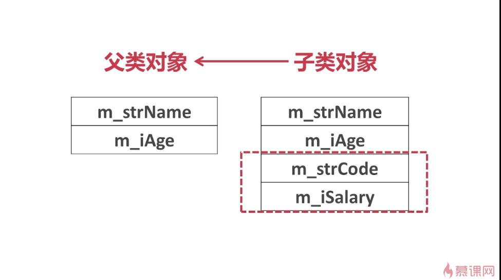
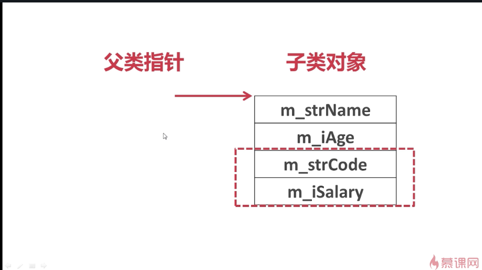

## isA

这样可以说隐形眼睛和眼睛是is-a关系。

可以说工人类是一个人的对象，士兵类也是一个人的对象。

### ----------------------------------------------------------------

在这个例子当中，实例化了Soldier类的一个对象s1；实例化Person的时候用s1去实例化p1，这句话是对的，因为一个士兵也是一个人。同理，Person *p2 = &s1;也是对的。
但是s1 = p1;是错的，因为我们不能说一个人是一个士兵。同理，Soldier *s2 = &p1;也是错的。
也就是说派生类的对象可以赋值给基类，或者子类的对象可以赋值给父类。可以用基类的指针指向派生类的对象。

### ----------------------------------------------------------------

既然如此，就可以将基类的指针或者基类的对象或者基类的引用作为函数的参数来使它可以接收所传入的子类的对象，并且也可以传入基类的对象。

### 存储结构----------------------------------------------------

这是将子类的对象赋值给父类的对象或者是用子类的对象初始化父类的变量的情况。
如果父类有m_strName、m_iAge的数据成员时，子类也会继承m_strName、m_iAge，同时还会拥有自己的数据成员。
当我们用子类的对象向父类的对象赋值或者是用子类的对象初始化父类的一个对象的时候，那么就是将子类当中从父类继承下来的m_strName、m_iAge的值赋值给父类的对象。子类当中其他的数据此时就会被截断，也就是丢失。

如果是用父类的指针指向一个子类的对象，那么父类的指针也只能够访问到父类原有的数据成员和成员函数，而无法访问到子类独有的数据成员和成员函数。