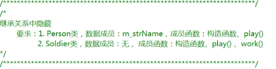
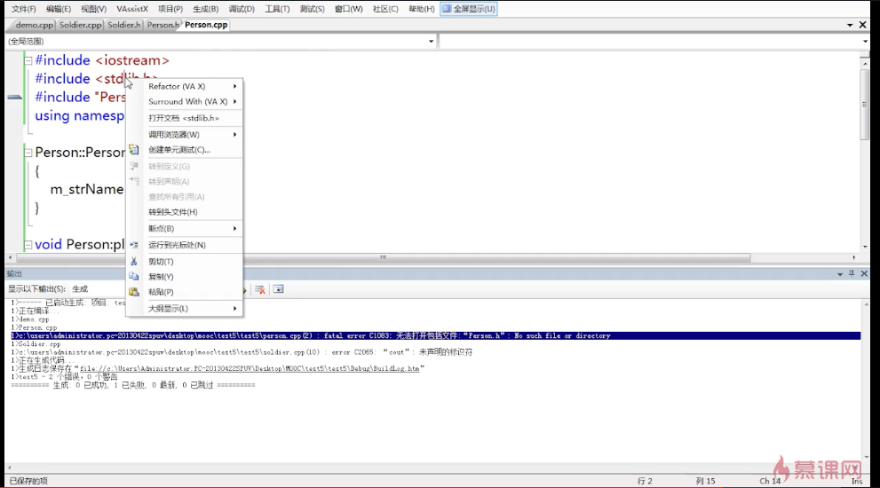
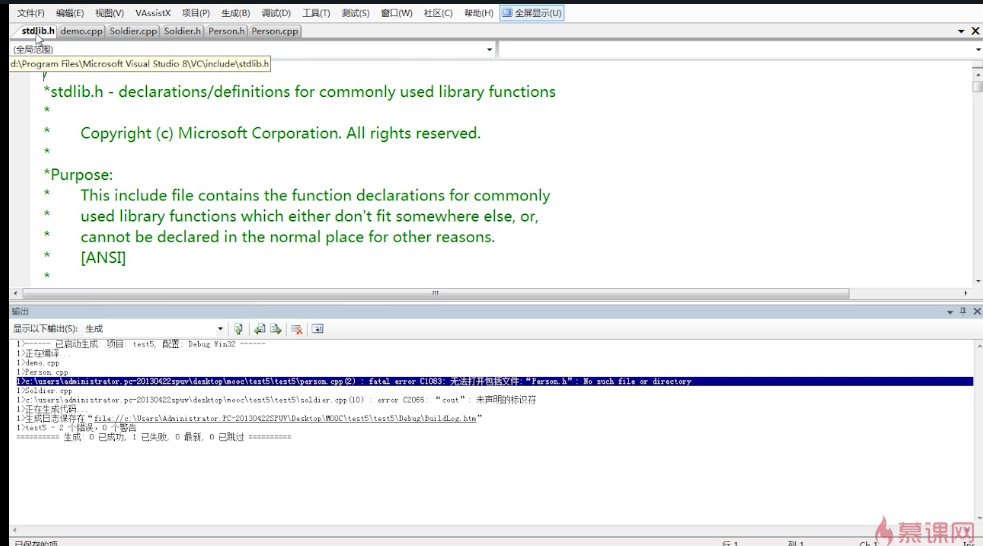
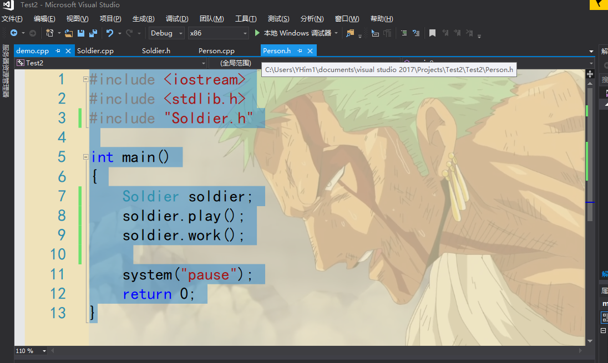
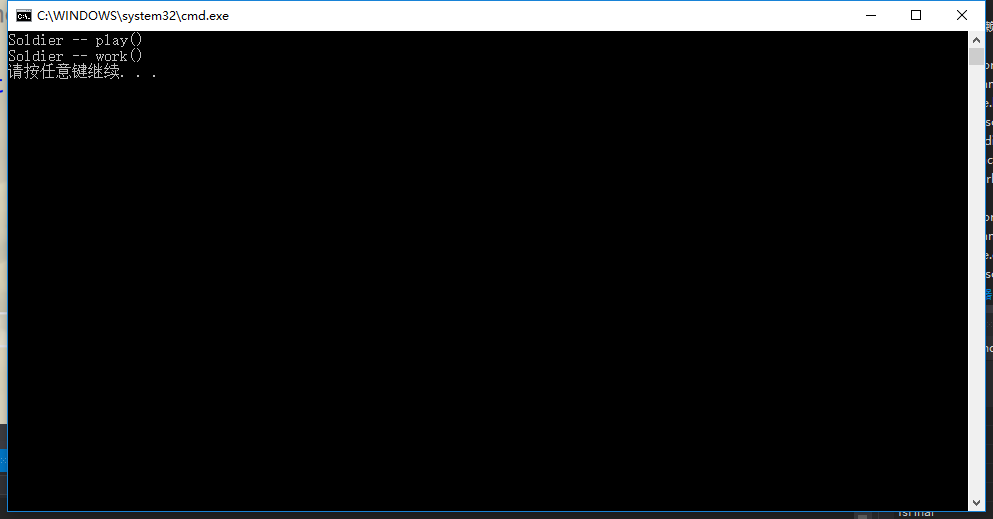
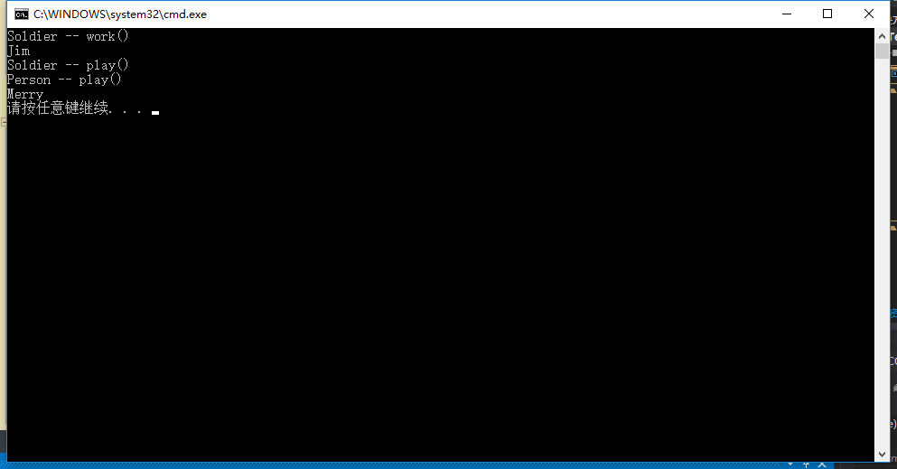
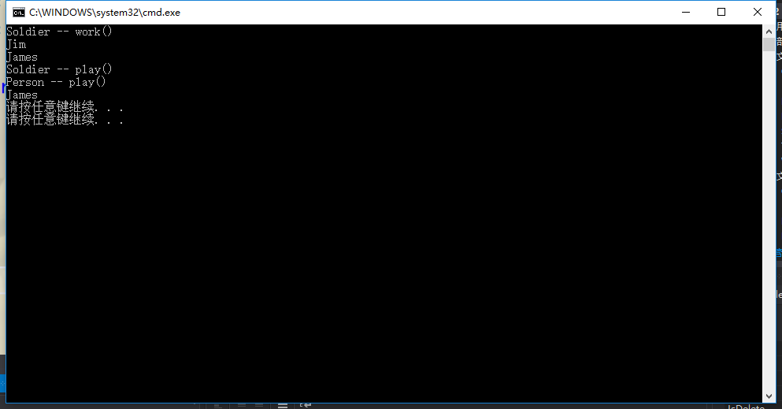

## 隐藏-例子
例子：



Person.h
```h
#include <string>
using namespace std;

class Person
{
public:
	Person();
	void play();
protected:
	string m_strName;
};
```

Person.cpp
```cpp
#include <Person.h> //这里会报错
#include <iostream>
using namespace std;

Person::Person()
{
	m_strName = "Merry";
}

void Person::play()
{
	cout << "Person -- play()" << endl;
	cout << m_strName << endl;
}
```

Soldier.h
```h
#include "Person.h"

class Soldier : public Person
{
public:
	Soldier();
	void play();
	void work();
protected:
	
};
```

Soldier.cpp
```cpp
#include <iostream>
#include "Soldier.h"
using namespace std;

Soldier::Soldier()
{

}

void Soldier::play()
{
	cout << "Soldier -- play()" << endl;
}

void Soldier::work()
{
	cout << "Soldier -- work()" << endl;
}
```

demo.cpp
```cpp
#include <iostream>
#include <stdlib.h>
#include "Soldier.h"

int main()
{
	Soldier soldier;
	soldier.play();
	soldier.work();
	
	system("pause");
	return 0;
}
```

程序报错。
比如在Person.cpp中使用#include "Person.h " ，计算机就会在程序的目录下去寻找Person.h文件，因为Person.cpp和Person.h在同一个目录下，所以使用这个搜索同目录下一定能搜索到。
当使用#include 时，它会去搜索程序的默认库。
那么默认库在哪？
可以#include ，然后在上点右键，



然后打开文档,然后移动鼠标到图上的位置，



就可以看到位置了。
如何查看自己写的代码的目录：



鼠标移到图上的位置就行了。

### 小总结
#include < > 和 #include " "的区别：
尖括号只会在默认目录下找，带双引号的先是在当前目录下寻找，如果没找到就去默认目录下找，这就是双引号和尖括号的区别。

将Person.cpp中的#include <Person.h>修改成#include "Person.h"，然后运行。




### -----------------------------------------------------------------
之前代码不变，将demo.cpp改为：
```cpp
#include <iostream>
#include <stdlib.h>
#include "Soldier.h"

int main()
{
	Soldier soldier;
	soldier.play();
	soldier.work();
	soldier.Person::play();//+
	system("pause");
	return 0;
}
```

添加的这行代码调用了soldier的父类Person类的play()。

### -----------------------------------------------------------------
继续
Soldier.h
```h
#include "Person.h"

class Soldier : public Person
{
public:
	Soldier();
	void play(int x);    //c
	void work();
protected:
	
};
```

Soldier.cpp
```cpp
#include <iostream>
#include "Soldier.h"
using namespace std;

Soldier::Soldier()
{

}

void Soldier::play(int x)    //c
{
	cout << "Soldier -- play()" << endl;
}

void Soldier::work()
{
	cout << "Soldier -- work()" << endl;
}
```

demo.cpp
```cpp
#include <iostream>
#include <stdlib.h>
#include "Soldier.h"

int main()
{
	Soldier soldier;
	soldier.play(7);//c
	soldier.work();
	soldier.play();
	system("pause");
	return 0;
}
```

运行，程序报错。提示demo.cpp中的soldier.play()需要参数，可见同名函数但参数不同的这种方法还是不能直接调用Person中的play()。即无法形成重载，只能进行隐藏。

### -----------------------------------------------------------------
继续
Soldier.h
```h
#include "Person.h"

class Soldier : public Person
{
public:
	Soldier();
	void play(int x);
	void work();
protected:
	string m_strName;//c
};
```

Soldier.cpp
```cpp
#include <iostream>
#include "Soldier.h"
using namespace std;

Soldier::Soldier()
{

}

void Soldier::play(int x)
{
	cout << m_strName << endl;//打印出来的就是soldier下的m_strName
	cout << "Soldier -- play()" << endl;
}

void Soldier::work()
{
	m_strName = "Jim";//这样写只能赋值给soldier下的m_strName，
	               //无法赋值给Person下的m_strName。
	cout << "Soldier -- work()" << endl;
}
```

demo.cpp
```cpp
#include <iostream>
#include <stdlib.h>
#include "Soldier.h"

int main()
{
	Soldier soldier;
	soldier.work();
	soldier.play(7);
	
	soldier.Person::play();
	system("pause");
	return 0;
}
```

运行结果：



如果想要访问Person中的m_strName，那么要通过下面的方式：
Soldier.cpp
```cpp
#include <iostream>
#include "Soldier.h"
using namespace std;

Soldier::Soldier()
{

}

void Soldier::play(int x)
{
	cout << m_strName << endl;//打印出来的就是soldier下的m_strName
	cout << Person::m_strName << endl;
	cout << "Soldier -- play()" << endl;
}

void Soldier::work()
{
	m_strName = "Jim";//这样写只能赋值给soldier下的m_strName，
	               //无法赋值给Person下的m_strName。
	Person::m_strName = "James";//给Person下的m_strName赋值。
	cout << "Soldier -- work()" << endl;
}
```

运行结果：



