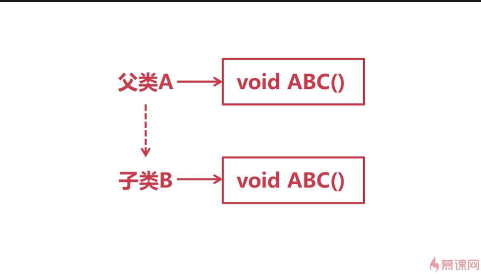
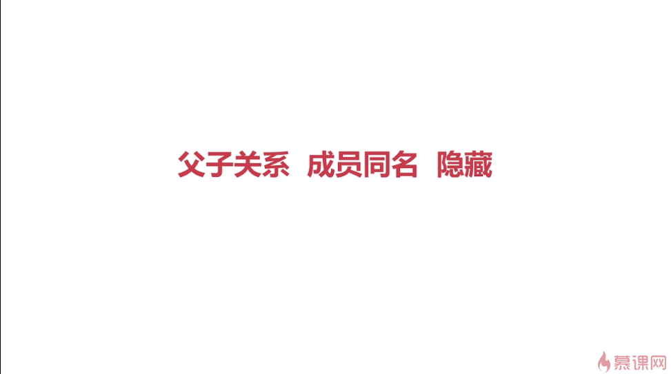
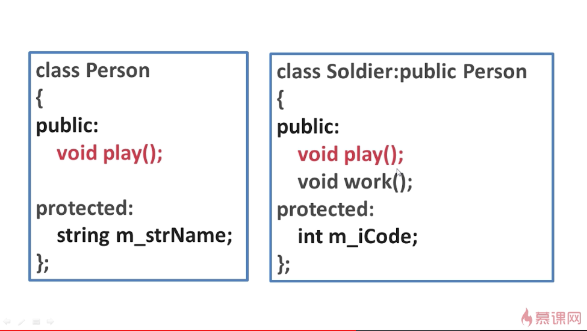
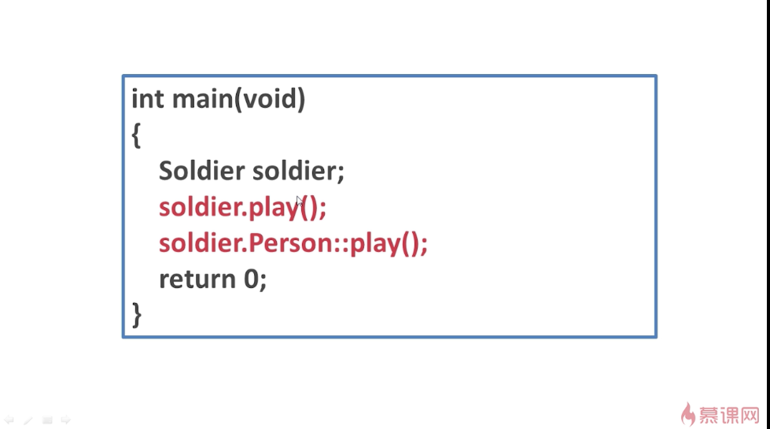
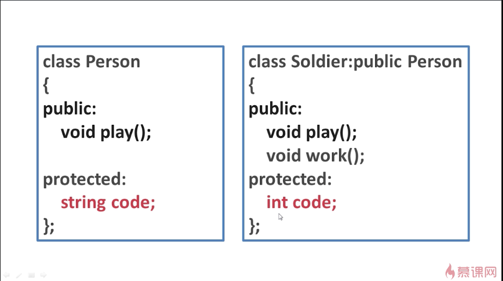
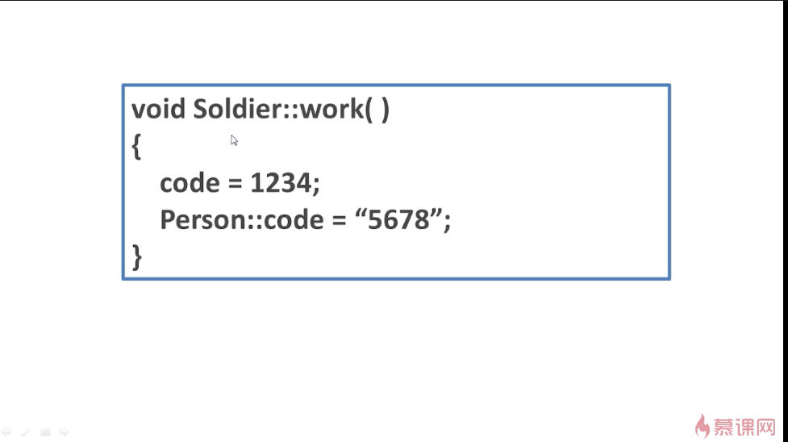

## 隐藏
例子：

假设在父类A当中定义了一个成员函数ABC()，然后又定义了子类B，B公有的继承了A，并且在子类B中也定义了同名的成员函数ABC()，这时子类B中就会隐藏掉从A中继承来的ABC()函数。
隐藏的特性主要体现在当实例化B的对象的时候，使用该对象只能够直接的访问到子类B当中的ABC()成员函数，而无法访问到A当中的ABC()成员函数。
但是，可以通过特殊的手段来访问父类A中的ABC()成员函数。这种特性称之为**隐藏**。
同名的数据成员和成员函数都具有隐藏的特征。

隐藏的关键字：

### -------------------------------------------------------
例子：

使用soldier.play()是直接调用soldier中的play().
而soldier.Person::play()是调用soldier的父类Person中的play()。

### -------------------------------------------------------

如果子类的数据成员和父类的数据成员同名，那么work()中的code调用的是Soldier类本身定义的code，Person::code调用的是Soldier的父类Person中定义的code。
使用比较好的命名方法可以一定程度上避免这种情况，比如Person类中定义为m_strCode，而Soldier中定义为m_iCode。